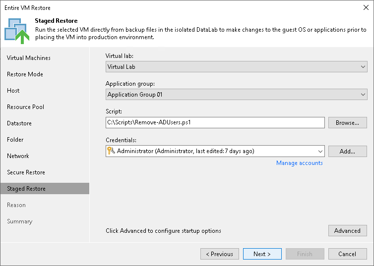
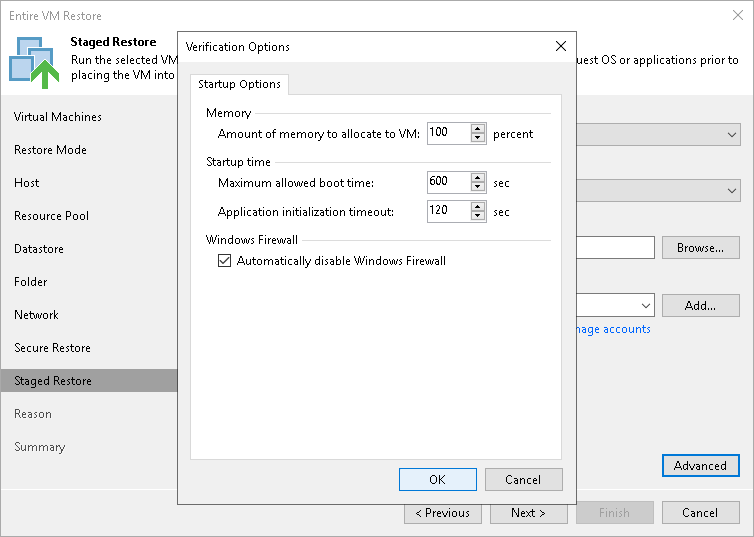

# Step 11. Specify Staged Restore Settings

The Staged Restore step of the wizard is available if you have chosen the Staged restore option at the [Restore Mode](full_restore_mode_vm.md) step of the wizard.

Staged restore to run an executable script for VMs before restoring them to the production environment. For more information, see [Staged Restore](staged_restore_about.md).

To specify staged restore settings:

1. From the Virtual lab list, select a virtual lab that will be used to start VMs. The list contains all virtual labs that are created or connected to the backup server.
2. From the Application group list, select an application group if script execution requires other VMs to be powered on. In the virtual lab during staged restore, Veeam Backup & Replication will start VMs from the selected application group in the required order. The Application group list contains all application groups that are created on the backup server. For more information, see [Application Group](application_group.md).
3. On the right of the Script field, click Browse to choose the script from a local folder on the backup server.
4. From the Credentials list, select credentials for the account that has administrator privileges on VMs for which you want to run the script. If you have not set up credentials beforehand, click the Manage accounts link or click Add on the right of the Credentials field to add the credentials. For more information, see [Credentials Manager](credentials_manager.md).

VM Startup Settings

If you want to start VMs after recovery, perform the following steps:

1. Click Advanced.
2. In the Memory section, specify the amount of memory that you want to pre-allocate to a VM when it starts. The amount of pre-allocated memory is defined in percent. The percentage rate is calculated based on the system memory level available for the production VM. For example, if 4096 MB of RAM is allocated to the VM in the production environment and you specify 50% as a memory rate, 2048 MB of RAM will be allocated to the VM on startup.
3. In the Startup time section, specify the allowed boot time for the VM and timeout to initialize applications on the VM.

Be careful when specifying the Maximum allowed boot time value. Typically, a VM started in a virtual lab requires more time to boot than a VM started in the production environment. If an application fails to be initialized within the specified interval of time, the recovery process fails with the timeout error. If such error occurs, you need to increase the Maximum allowed boot time value and perform VM restore again.

