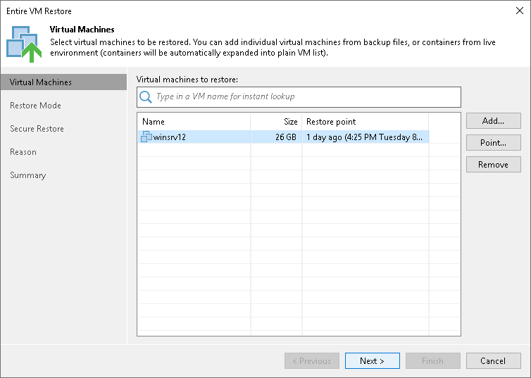

# Step 2. Select VMs

At the Virtual Machines step of the wizard, select VMs that you want to restore:

1. Click Add.
2. Select where to browse for VMs:

* From infrastructure — browse the virtual environment and select VMs or VM containers to restore. If you choose a VM container, Veeam Backup & Replication will expand it to a plain VM list.

* From backup — browse existing backups and select VMs under backup jobs.

[Step 5. Select Target Host](full_restore_host_vm.md)

