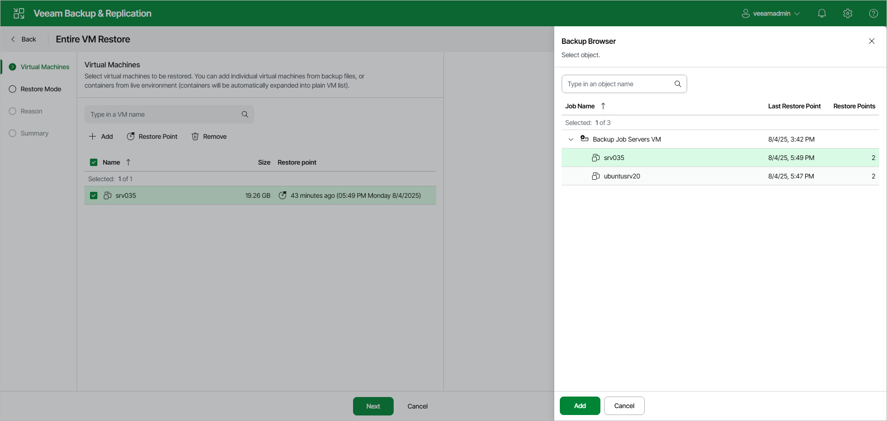
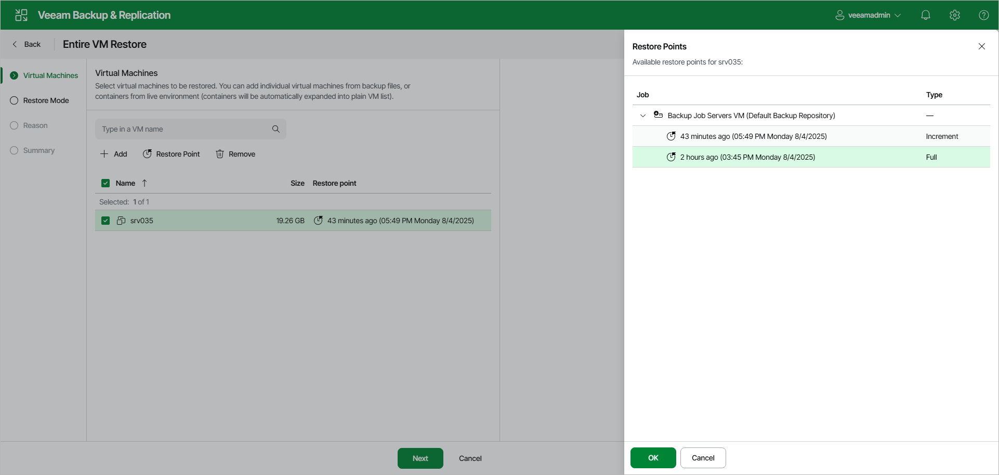

# Step 2. Select VMs and Restore Points

In this article

At the Virtual Machines step of the wizard, you can change the list of VMs that you want to recover and also select restore points.

Selecting VMs to Recover

You can add or delete VMs from the recovery list. To add VMs, click Add and select VMs that you want to add from the opened list. To save the changes, click Add. To delete VMs, select the necessary VMs and click Remove.

Selecting Restore Points

To select a restore point:

1. Select the VMs for which you want to change the restore point.
2. Click Restore Point.
3. In the Restore Points window, choose the necessary restore point.
4. To save the changes, click OK.

Page updated 8/6/2025

Page content applies to build 13.0.1.1071
