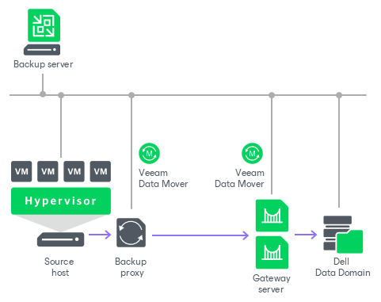

# Gateway Servers

In this article

A gateway server is an auxiliary backup infrastructure component that “bridges” the backup server and backup repository. It can also "bridge" a source backup repository and a target backup repository in case of backup copy jobs. The gateway server is required if you deploy the following types of backup repositories in the backup infrastructure:

* [Shared folder backup repositories](backup_repository.md)
* [Dell Data Domain deduplicating storage appliance](dell_dd.md)
* [HPE StoreOnce deduplicating storage appliance](deduplicating_appliance_storeonce.md)
* [Object storage repository](object_storage_repository.md)

Such backup repositories cannot host [Veeam Data Movers](veeam_transport_service.md) — Veeam components that establish a connection between a backup proxy and backup repository (in case of backup jobs) or between backup repositories (in case of backup copy jobs). To overcome this limitation, Veeam Backup & Replication uses gateway servers.

In the backup infrastructure, a gateway server hosts the target Veeam Data Mover. Veeam Backup & Replication establishes a connection between the source Veeam Data Mover and target Veeam Data Mover, and transports data from/to backup repositories through gateway servers.

For more information on using gateway servers in backup copy jobs, see [Backup Copy Architecture](backup_copy_path.md).

Requirements and Limitations for Gateway Servers

Consider the following:

* The gateway server can run on a Microsoft Windows or Linux machine or Microsoft Hyper-V host that is added to the backup infrastructure as a managed server. The machine must meet the system requirements. For more information, see [System Requirements](system_requirements.md#gateway).

* The fast clone on ReFS volumes feature requires a Microsoft Windows gateway server.

* The machine must have access to the backup repository — shared folder, Dell Data Domain or HPE StoreOnce.
* For deduplicating storage appliances working over Fibre Channel, you must explicitly select at least one gateway server that will communicate with the appliance over Fibre Channel connection.
* If connection to the gateway server is lost during the job run, the job fails. Veeam Backup & Replication selects a new available gateway server when the job starts next time.
* If you plan to use the Veeam Software Appliance with Veeam Backup & Replication as the gateway server for an NFS backup repository, make sure that the export option on the NFS share is set to all\_squash. Otherwise, the gateway server will not able to work with the share.

Gateway Server Deployment

To configure a gateway server, you must first add a machine that you plan to use as a gateway server to the backup infrastructure using the New Windows Server or New Linux Server wizard. For more information, see [Adding Microsoft Windows Servers](add_windows_server.md) or [Adding Linux Servers](add_linux_server.md).

After that, you must go through the New Backup Repository wizard and define gateway server settings. For more information, see [Adding Backup Repositories](dsa_repository_server.md). You can select a gateway server explicitly or instruct Veeam Backup & Replication to select it automatically.

If you plan to select gateway servers explicitly, these servers must be located as close to the backup repository as possible. However, if you use a deduplicating storage appliance with source-side data deduplication, it is reasonable to assign the roles of gateway servers to machines that are located closer to the backup proxy. This will help you reduce the amount of traffic traveling over the network. For more information, see [Dell Data Domain](dell_dd.md) and [HPE StoreOnce](deduplicating_appliance_storeonce.md).

Gateway Selection

Whenever possible, Veeam Backup & Replication distributes the backup workload between multiple available gateway servers. This helps optimize performance of multiple concurrent tasks. Veeam Backup & Replication assigns a separate gateway server for each task, based on gateway server connectivity and their current load. When Veeam Backup & Replication selects gateway servers, the following applies:

* If the number of tasks is greater than the number of available gateway servers, Veeam Backup & Replication uses one gateway server for multiple tasks.
* Veeam Backup & Replication uses one gateway server for the whole job if the Use per-machine backup files option is disabled for the repository to which the job is targeted at. For more information on this option, see [Backup Chain Formats](per_vm_backup_files.md).
* For per-machine VM backups, Veeam Backup & Replication uses one gateway server to process all disks of a VM.

You can select gateway servers explicitly or instruct Veeam Backup & Replication to select them automatically. For more information on which backup infrastructure components Veeam Backup & Replication uses as gateway servers during automatic selection, see the [Automatic Selection](#auto) section.

Manual Gateway Selection

If you select gateway servers explicitly, Veeam Backup & Replication uses only the selected servers and performs all operations on them. Veeam Backup & Replication analyzes the gateway server connectivity and their current task load, and picks the most suitable gateway server for the next task.

|  |
| --- |
| Important |
| If you select only one gateway server explicitly and it is not accessible, the job will fail. |

Automatic Gateway Selection

If you instruct Veeam Backup & Replication to select gateway servers automatically, Veeam Backup & Replication uses the backup infrastructure components described in the following table. Note that principles described in the [Gateway Selection](#selection) section also apply, and multiple gateway servers may be used for concurrent tasks. If the primary selection gateway server is not accessible, Veeam Backup & Replication fails over to the next available option.

| Type of job | Component used as gateway server | Component used as gateway server for synthetic operations |
| --- | --- | --- |
| Backup job / File backup job | [For VMware vSphere environments] Backup proxy that was assigned first to process workload data / file share for a backup job.  [For Microsoft Hyper-V environments] Backup proxy (onhost or offhost).  For backup and file backup jobs to an object storage repository with the direct connection mode, Veeam Backup & Replication does not use only one proxy as the gateway server for the entire job duration. Instead, it assigns the role of a gateway server to the least loaded available proxy before each operation. | Synthetic operations are performed on the mount server associated with the backup repository. If the mount server is not accessible, Veeam Backup & Replication fails over to the backup server. |
| Backup copy job / File backup copy job | For backup copy and file copy jobs, the selected gateway depends on the type of the source backup repository:   * [Direct attached repository](backup_repository.md). The mount server associated with the backup repository is used as the gateway server. If the mount server is not accessible, Veeam Backup & Replication fails over to the backup server. * Backup repository with the gateway server connection. The gateway of the source backup repository is used.   For backup copy and file copy jobs to an [object storage repository](object_storage_repository.md) with the direct connection mode, the source backup repository is used as the gateway server.  For backup copy jobs that work over WAN accelerators, the role of a gateway server is assigned to source or target WAN accelerator (depending on the shared folder backup repository location). File backup copy job does not support WAN accelerators. | Synthetic operations are performed on the mount server associated with the backup repository. If the mount server is not accessible, Veeam Backup & Replication fails over to the backup server.  These rules are applied to the direct data path and processing over WAN accelerators. File backup copy job does not support WAN accelerators. |
| Tape job | If there is a direct connection between a backup repository and tape device, the role of a gateway server is assigned to the tape server.  Otherwise, the role of a gateway server is assigned to the backup server. | Synthetic operations are performed on the mount server associated with the backup repository. If the mount server is not accessible, Veeam Backup & Replication fails over to the backup server. |
| Veeam Agent backup job | Mount server associated with the backup repository. If the mount server is not accessible, Veeam Backup & Replication fails over to the backup server. | Synthetic operations are performed on the mount server associated with the backup repository. If the mount server is not accessible, Veeam Backup & Replication fails over to the backup server. |
| Backup job created by Veeam Plug-In for Oracle RMAN/SAP HANA/SAP on Oracle/Microsoft SQL Server/DB2 | Backup server. | — |
| Restore operations | Backup proxy used for a restore operation. | — |
| Replication from backup | Target backup proxy assigned for a replication operation. | — |
| Repository rescan | Mount server associated with the backup repository. | — |
| Offload job | If you offload backups to an object storage repository with the direct connection mode, the selected gateway depends on the type of the source backup repository:   * [Direct attached repository](backup_repository.md). The source backup repository is used as the gateway server. For hardened repository, the role of the gateway server is assigned to the hardened repository. * [Non-direct attached repository](backup_repository.md). The gateway of the source backup repository is used. * Object storage repository with the direct connection mode. The mount server associated with the source backup repository is used as the gateway server. If the mount server is not accessible, Veeam Backup & Replication fails over to the backup server. * Object storage repository with the gateway server connection. The gateway of the source backup repository is used. | — |
| Move and copy operations | If you copy or move backups to an object storage repository with the direct connection mode, the selected gateway depends on the type of the source backup repository:   * [Direct attached repository](backup_repository.md). The source backup repository is used as the gateway server. For hardened repository, the role of the gateway server is assigned to the hardened repository. * [Non-direct attached repository](backup_repository.md). The gateway of the source backup repository is used. * Object storage repository with the direct connection mode. The mount server associated with the source backup repository is used as the gateway server. If the mount server is not accessible, Veeam Backup & Replication fails over to the backup server. * Object storage repository with the gateway server connection. The gateway of the source backup repository is used.   If you copy or move backups to other non-direct attached backup repository, the role of the gateway server is assigned to mount server. If mount server is not accessible, Veeam Backup & Replication fails over to the backup server. | — |
| Health check operation | Mount server associated with the backup repository. | — |

Related Topics

* [Scale-Out Backup Repositories](backup_repository_sobr.md)
* [Specifying Server or Shared Folder Settings](repository_server.md)

Page updated 10/17/2025

Page content applies to build 13.0.1.1071
