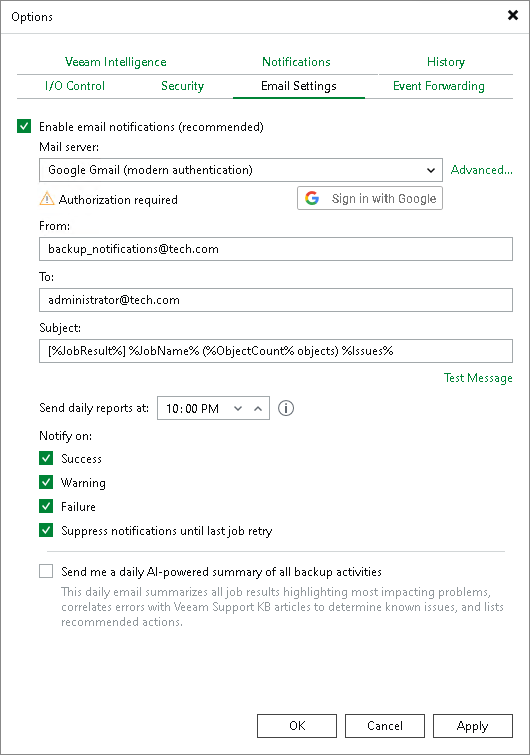
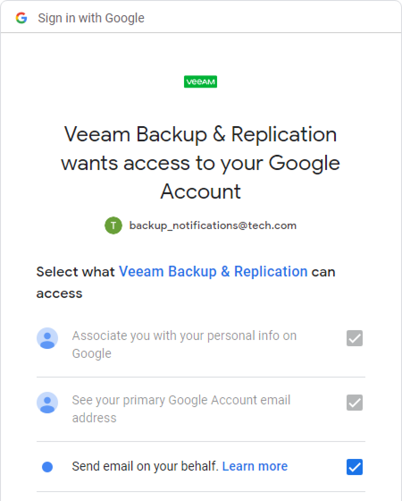
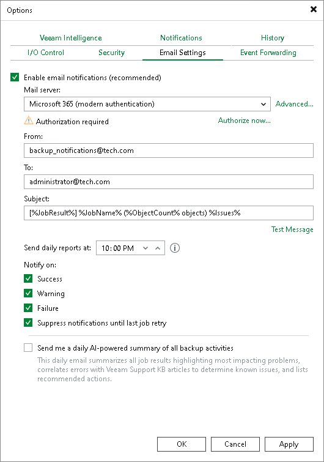

# Configuring Global Email Notification Settings

To configure global email notification settings:

1. From the main menu, select Options.
2. Open the Email Settings tab and select the Enable email notifications check box.
3. [Configure mail server](#configuring_mail_server).
4. [Customize send settings](#customizing_send_settings).

Configuring Mail Server

To configure mail server, perform the following steps:

1. In the Mail server field, specify the authentication method you want to use. Veeam Backup & Replication supports the following methods:

* SMTP basic authentication
* Google Gmail OAuth 2.0 authentication
* Microsoft 365 OAuth 2.0 authentication

|  |
| --- |
| Note |
| For more secure environments, it is recommended to use OAuth 2.0 authentication. Also, note that Microsoft and Google consider SMTP basic authentication as an outdated industry standard and they disabled it. For more information, see [this Microsoft article](https://learn.microsoft.com/en-us/exchange/clients-and-mobile-in-exchange-online/deprecation-of-basic-authentication-exchange-online) and [this Google article](https://support.google.com/accounts/answer/6010255). |

1. If you want to use SMTP basic authentication, perform the following steps:

1. In the Mail server field, select SMTP server from the list.
2. In the SMTP server field, enter a full DNS name, or IPv4 or IPv6 address of the SMTP server that will be used for sending email notifications. Note that you can use IPv6 addresses only if IPv6 communication is enabled as described in section [IPv6 Support](ipv6.md).

1. To specify user credentials and connection options, click the Advanced button:

* Specify the port number and connection timeout for the SMTP server.

|  |
| --- |
| Note |
| Sending email notifications using Implicit TLS (over port 465) is not supported. For more information about Implicit TLS, see [this RFC section](https://www.rfc-editor.org/rfc/rfc8314#section-3). |

* To use a secure connection for email operations, select the Connect using SSL check box.
* If you need to connect to the SMTP server using a specific account, select the This SMTP server requires authentication check box and select the necessary credentials from the Log on as list. If you have not set up credentials beforehand, click the Manage accounts link or click Add on the right to add credentials. For more information, see [Credentials Manager](credentials_manager.md).

When you add an SMTP server, Veeam Backup & Replication saves to the configuration database a thumbprint of the TLS certificate. If the certificate is not trusted, Veeam Backup & Replication displays a warning. If you trust the certificate, click Continue.

1. If you want to use Google Gmail OAuth 2.0 authentication, perform the following steps:

1. In the Mail server field, select Google Gmail from the list and click the Sign in with Google button.

1. In the opened web browser window, specify the Google account to connect to the Veeam Backup & Replication application. Note that you must select Send email on your behalf check box during configuring access options.

|  |
| --- |
| Note |
| Consider the following:   * For security reasons, it is recommended to use a dedicated service account with granular SendMail permissions. * To sign in with the Google account, your default web browser must meet Google requirements. For more information, see [this article](https://support.google.com/accounts/answer/7675428?hl=en). |

If the authentication is successful, the Token is valid notice will appear. The token is refreshed automatically. If it was revoked or the Google account password was changed, click the Re-authorize link to update configuration.

To specify custom authentication options, click the Advanced button:

* Select the Use custom application registration settings check box.
* Specify the application client ID and the client secret.

For more information on how to register your custom application, see [Registering Application in Google Cloud Console](registering_google_app.md).

1. If you want to use Microsoft 365 OAuth 2.0 authentication, perform the following steps:

1. In the Mail server field, select Microsoft 365 from the list and click the Authorize now link.

1. In the opened window, specify your Exchange Online credentials to connect to the Veeam Backup & Replication application.

|  |
| --- |
| Note |
| Consider the following:   * For security reasons, it is recommended to use a dedicated service account with granular SendMail permissions. * To sign in with Exchange Online credentials, turn off the Internet Explorer Enhanced Security Configuration option in Server Manager. For more information, see [this article](https://learn.microsoft.com/en-us/previous-versions/troubleshoot/browsers/security-privacy/enhanced-security-configuration-faq#how-to-turn-off-internet-explorer-esc-on-windows-servers). |

If the authentication is successful, the Token is valid notice will appear. The token is refreshed automatically. If it was revoked or Exchange Online credentials were changed, click the Re-authorize link to update configuration.

To specify custom authentication option, click the Advanced button:

* Select the Use custom application registration settings check box.
* Specify the application client ID and the tenant ID.

|  |
| --- |
| Note |
| For custom applications, note that you must select Consent on behalf of your organization check box during configuring access options. |

For more information on how to register your custom application, see [Registering Application in Microsoft Azure Portal](registering_azure_app.md).

Customizing Send Settings

To customize send settings, perform the following steps:

1. In the From field, specify an email from which email notifications must be sent. Note that for OAuth 2.0 authentication, it must be the account you use to connect to the Veeam Backup & Replication application.

1. In the To field, specify the recipient addresses. Use a semicolon to separate multiple addresses. Recipients specified in this field will receive notification about every job managed by the backup server. You can leave the field empty if required.

For every particular job, you can specify additional recipients. For more information, see [Configuring Job Notification Settings](job_email_notifications.md).

|  |
| --- |
| Important |
| If you specify the same email recipient in both job notification and global notification settings, Veeam Backup & Replication will send the job notification only. |

1. In the Subject field, specify a subject for the sent message. You can use the following variables in the subject:

1. %Time% — completion time
2. %JobName%
3. %JobResult%
4. %ObjectCount% — number of VMs in the job
5. %Issues% — number of VMs in the job that have been processed with the Warning or Failed status

1. In the Send daily reports at field, specify at what time Veeam Backup & Replication will send daily email reports. Daily reports are generated for different purposes throughout Veeam Backup & Replication:

* Reports about processing results of scale-out repository data. For more information, see [Receiving Scale-Out Backup Repository Reports](sobr_reports.md).
* Reports about processing results of backup copy jobs. For more information, see [Notification Settings](backup_copy_settings_notification.md) in the Creating Backup Copy Jobs for VMs and Physical Machines section.
* Reports about processing results of backup copy jobs for transaction log backups. For more information about transaction log backups, see [Microsoft SQL Server Logs Backup](sql_backup.md).
* Reports about backups of virtual and physical machines created by [Veeam Agent for Microsoft Windows or Veeam Agent for Linux](agents_introduction.md) in the Managed by Agent mode.
* Reports with statistics for rescan job sessions performed for protection groups of virtual and physical machines created by [Veeam Agent for Microsoft Windows or Veeam Agent for Linux](agents_introduction.md).
* Reports about processing results of backup copy jobs for backups created by [Veeam Plug-Ins for Enterprise Applications](protect_applications.md).
* Reports about active Instant Recovery sessions, that is, sessions that were not finalized. For more information about Instant Recovery, see [Instant Recovery to VMware vSphere](instant_recovery.md) and [Instant Recovery to Microsoft Hyper-V](instant_recovery_to_hv.md).
* Reports about malware detection events that were created in the last 24 hours. For more information, see [Notifications](malware_detection_notifications.md) in the Configuring Malware Detection section.

|  |
| --- |
| Note |
| Settings configured for a certain report override global notification settings. |

1. In the Notify on group, select the Success, Warning and Failure check boxes to receive email notification if a job is run successfully, not successfully or with a warning.

1. Select the Suppress notifications until the last retry check box to receive a notification about the final job status. If you do not enable this option, Veeam Backup & Replication will send one notification per every job retry. This option does not apply to immediate backup copy jobs.

1. Veeam Backup & Replication allows sending a test email to check if all settings have been configured correctly. To send a test email, click Test Message.
2. Select the Send me a daily AI-powered summary of all backup activities check box to receive daily summary report. For more information, see [Data Resilience Daily Summary Report](backup_reporting_email.md#morning_coffe_report).

