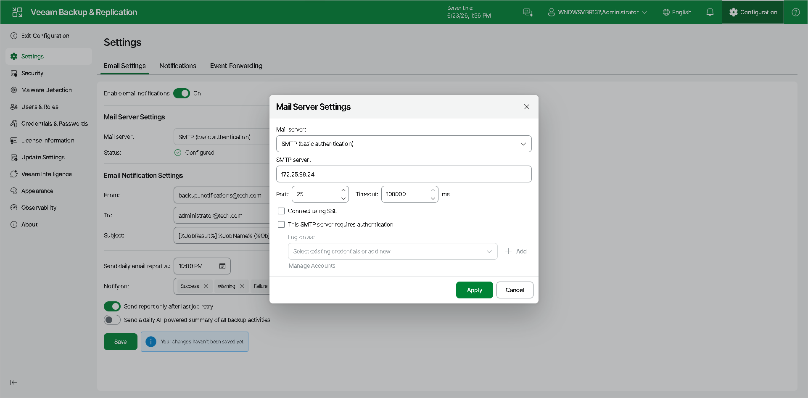
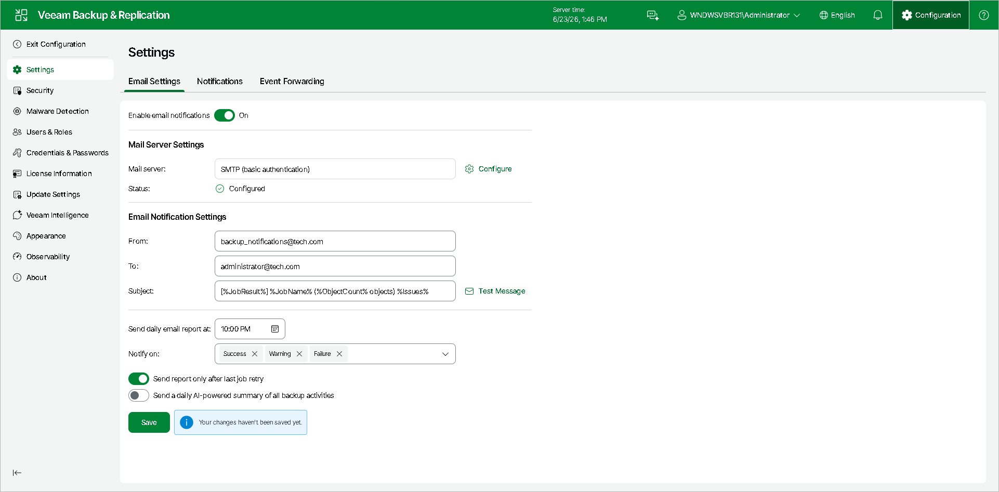
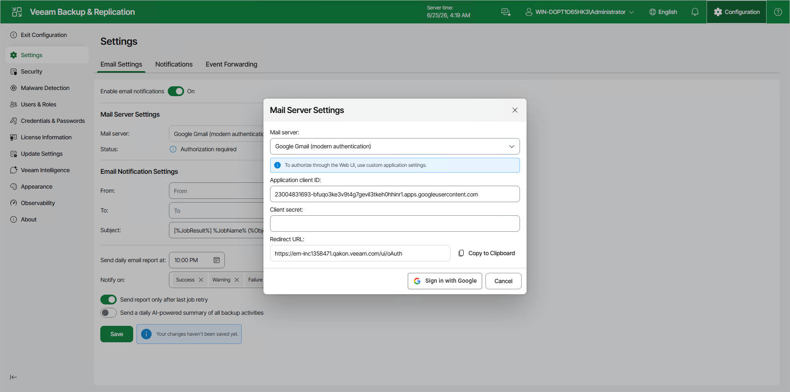
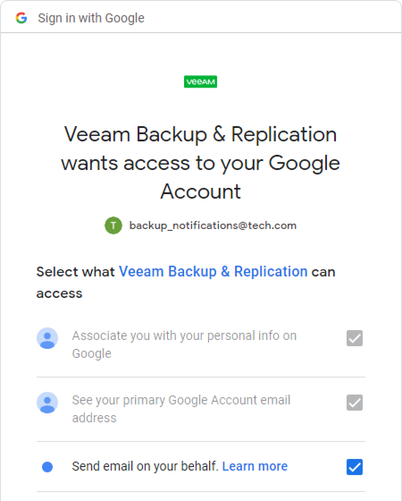
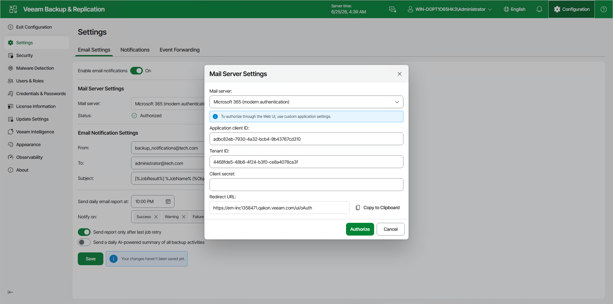
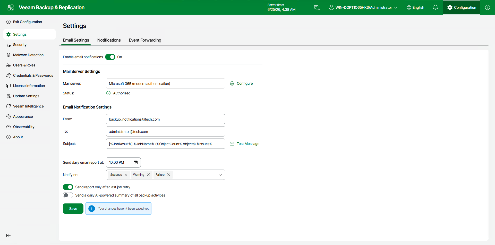
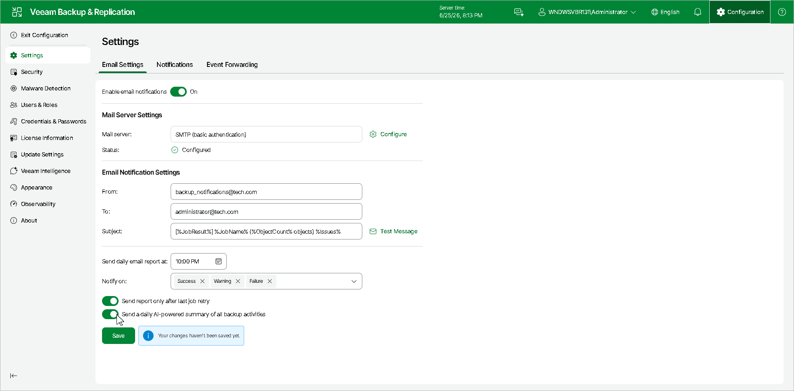

# Configuring Global Email Notification Settings Using Web UI

To configure global email notification settings in the Veeam Backup & Replication web UI:

1. Click Configuration in the top bar.
2. Open the Email Settings tab and set the Enable email notifications toggle to On.
3. [Configure mail server](general_email_notifications_web.md#configuring_mail_server).
4. [Customize send settings](general_email_notifications_web.md#customizing_send_settings).
5. [Enable the data resilience daily summary report](general_email_notifications_web.md#enable_ai_report).

Configuring Mail Server

To configure mail server, in the Mail server field, specify the authentication method you want to use. Veeam Backup & Replication supports the following methods:

* [SMTP basic authentication](#smtp_auth)
* [Google Gmail OAuth 2.0 authentication](#gmail_auth)
* [Microsoft 365 OAuth 2.0 authentication](#microsoft_auth)

|  |
| --- |
| Note |
| Consider the following:   * For more secure environments, it is recommended to use OAuth 2.0 authentication. Also, note that Microsoft and Google consider SMTP basic authentication as an outdated industry standard and they disabled it. For more information, see [this Microsoft article](https://learn.microsoft.com/en-us/exchange/clients-and-mobile-in-exchange-online/deprecation-of-basic-authentication-exchange-online) and [this Google article](https://support.google.com/accounts/answer/6010255). * In an HA cluster environment, Veeam Backup & Replication sends email reports from the IP address of the current primary node, not from the cluster (virtual) IP address. Ensure that your mail filters accept connections from both node IP addresses. |

Configuring SMTP Basic Authentication

If you want to use SMTP basic authentication, perform the following steps:

1. Click Configure next to the Mail server field. In the Mail Server Settings window, select SMTP {basic authentication} from the list.

1. In the SMTP server field, enter a full DNS name, or IPv4 or IPv6 address of the SMTP server that will be used for sending email notifications. Note that you can use IPv6 addresses only if IPv6 communication is enabled as described in section [IPv6 Support](ipv6.md).
2. To specify user credentials and connection options:

* Specify the port number and connection timeout for the SMTP server.

|  |
| --- |
| Note |
| Sending email notifications using Implicit TLS (over port 465) is not supported. For more information about Implicit TLS, see [this RFC section](https://www.rfc-editor.org/rfc/rfc8314#section-3). |

* To use a secure connection for email operations, select the Connect using SSL check box.

* If you need to connect to the SMTP server using a specific account, select the This SMTP server requires authentication check box and select the necessary credentials from the Log on as list. If you have not set up credentials beforehand, click the Manage accounts link or click Add on the right to add credentials. For more information, see [Credentials Manager](credentials_manager.md).

When you add an SMTP server, Veeam Backup & Replication saves to the configuration database a thumbprint of the TLS certificate. If the certificate is not trusted, Veeam Backup & Replication displays a warning. If you trust the certificate, click Continue.

Configuring Google Gmail OAuth 2.0 Authentication

If you want to use Google Gmail OAuth 2.0 authentication, perform the following steps:

1. Click Configure next to the Mail server field. In the Mail Server Settings window, select Google Gmail from the list, enter the application client ID and client secret and click the Sign in with Google button.

1. In the opened web browser window, specify the Google account to connect to the Veeam Backup & Replication application. Note that you must select Send email on your behalf check box during configuring access options.

|  |
| --- |
| Note |
| Consider the following:   * For security reasons, it is recommended to use a dedicated service account with granular SendMail permissions. * To sign in with the Google account, your default web browser must meet Google requirements. For more information, see [this article](https://support.google.com/accounts/answer/7675428?hl=en). |

If the authentication is successful, the Token is valid notice will appear. The token is refreshed automatically. If it was revoked or the Google account password was changed, click the Re-authorize link to update configuration.

Configuring Microsoft 365 OAuth 2.0 Authentication

If you want to use Microsoft 365 OAuth 2.0 authentication, perform the following steps:

1. Click Configure next to the Mail server field. In the Mail Server Settings window, select Microsoft 365 (modern authentication) from the list, enter the application client ID, tenant ID, and client secret, and click Authorize.

1. In the opened window, specify your Exchange Online credentials to connect to the Veeam Backup & Replication application.

|  |
| --- |
| Note |
| Consider the following:   * For security reasons, it is recommended to use a dedicated service account with granular SendMail permissions. * To sign in with Exchange Online credentials, turn off the Internet Explorer Enhanced Security Configuration option in Server Manager. For more information, see [this article](https://learn.microsoft.com/en-us/previous-versions/troubleshoot/browsers/security-privacy/enhanced-security-configuration-faq#how-to-turn-off-internet-explorer-esc-on-windows-servers). |

If the authentication is successful, the Token is valid notice will appear. The token is refreshed automatically. If it was revoked or Exchange Online credentials were changed, click the Re-authorize link to update configuration.

Customizing Send Settings

To customize send settings, perform the following steps:

1. In the From field, specify an email from which email notifications must be sent. Note that for OAuth 2.0 authentication, it must be the account you use to connect to the Veeam Backup & Replication application.
2. In the To field, specify the recipient addresses. Use a semicolon to separate multiple addresses. Recipients specified in this field will receive notification about every job managed by the backup server. You can leave the field empty if required.

   For every particular job, you can specify additional recipients. For more information, see [Configuring Job Notification Settings](job_email_notifications.md).

   |  |
   | --- |
   | Important |
   | If you specify the same email recipient in both job notification and global notification settings, Veeam Backup & Replication will send the job notification only. |
3. In the Subject field, specify a subject for the sent message. You can use the following variables in the subject:

1. %Time% — completion time
2. %JobName%
3. %JobResult%
4. %ObjectCount% — number of VMs in the job
5. %Issues% — number of VMs in the job that have been processed with the Warning or Failed status

1. In the Send daily reports at field, specify at what time Veeam Backup & Replication will send daily email reports. Daily reports are generated for different purposes throughout Veeam Backup & Replication:

* Reports about processing results of scale-out repository data. For more information, see [Receiving Scale-Out Backup Repository Reports](sobr_reports.md).
* Reports about processing results of backup jobs. For more information, see [Notification Settings](backup_job_advanced_notify_vm.md) in the Creating Backup Jobs.
* Reports about processing results of backup copy jobs. For more information, see [Notification Settings](backup_copy_settings_notification.md) in the Creating Backup Copy Jobs for VMs and Physical Machines section.
* Reports about processing results of backup copy jobs for transaction log backups. For more information about transaction log backups, see [Microsoft SQL Server Logs Backup](sql_backup.md).
* Reports about backups of virtual and physical machines created by [Veeam Agent for Microsoft Windows or Veeam Agent for Linux](agents_introduction.md) in the Managed by Agent mode.
* Reports with statistics for rescan job sessions performed for protection groups of virtual and physical machines created by [Veeam Agent for Microsoft Windows or Veeam Agent for Linux](agents_introduction.md).
* Reports about processing results of backup copy jobs for backups created by [Veeam Plug-Ins for Enterprise Applications](protect_applications.md).
* Reports about active Instant Recovery sessions, that is, sessions that were not finalized. For more information about Instant Recovery, see [Instant Recovery to VMware vSphere](instant_recovery.md) and [Instant Recovery to Microsoft Hyper-V](instant_recovery_to_hv.md).
* Reports about malware detection events that were created in the last 24 hours. For more information, see [Notifications](malware_detection_notifications.md) in the Configuring Malware Detection section.

|  |
| --- |
| Note |
| Settings configured for a certain report override global notification settings. |

1. From the Notify on list, select the job result statuses for which you want to receive email notifications: Success, Warning, Failure.
2. Set the Send report only after last job retry toggle to On to receive a notification only about the final job status. If you leave this toggle set to Off, Veeam Backup & Replication will send one notification per every job retry. This option does not apply to immediate backup copy jobs.
3. Veeam Backup & Replication allows sending a test email to check if all settings have been configured correctly. To send a test email, click Test Message.
4. Click Save to apply the settings.

Job Session Report

By default, after you enable and configure global email notification settings, Veeam Backup & Replication sends an email notification after each job session completes. You can enable and specify custom notification settings for a specific job. This may be useful if you want to change the subject, the notification rules, or the list of recipients for certain reports. For more information, see [Configuring Job Notification Settings](job_email_notifications.md).

Software Updates Summary

By default, after you enable and configure global email notification settings, Veeam Backup & Replication sends a daily report at 10:00 PM that includes a list of software updates that ended with Success, Warning or Failure.

Rescan Job Report

By default, after you enable and configure global email notification settings, Veeam Backup & Replication sends rescan job reports daily at 10:00 PM. These reports are generated only for rescan jobs associated with protection groups. Veeam Backup & Replication sends a separate report for each protection group that has rescan job reporting enabled. The report contains cumulative statistics for rescan job sessions performed during the last 24-hour period. You can specify custom notification settings for a specific protection group.

Backup Policy Report

By default, after you enable and configure global email notification settings, Veeam Backup & Replication sends backup policy reports daily at 10:00 AM for Veeam Agent backup policies. Veeam Backup & Replication sends a separate report for each backup policy that you configured. The report contains cumulative statistics for backup job sessions performed during the last 24-hour period on computers to which the backup policy is applied.

Data Resilience Daily Summary Report (Morning Coffee Report)

The AI-generated daily summary report gives a detailed overview of all job sessions and their statuses. The report lists errors and warnings, explains their causes, and recommends actions to resolve them. It also includes links to relevant resources and groups error codes by workload, which helps simplify the troubleshooting process.

To configure Veeam Backup & Replication to send the data resilience daily summary report by email, you must enable Veeam Intelligence Advanced mode and have a valid Veeam Backup & Replication license.

To turn on the report, do the following:

1. Click Configuration in the top bar.
2. In the left navigation pane, click Veeam Intelligence and set the mode to Advanced. For more information about the Advanced mode, see [Veeam Intelligence](veeam_ai_online_assistant.md).
3. On the Email Settings tab, set the Send a daily AI-powered summary of all backup activities toggle to On.

Page updated 2026-07-20

