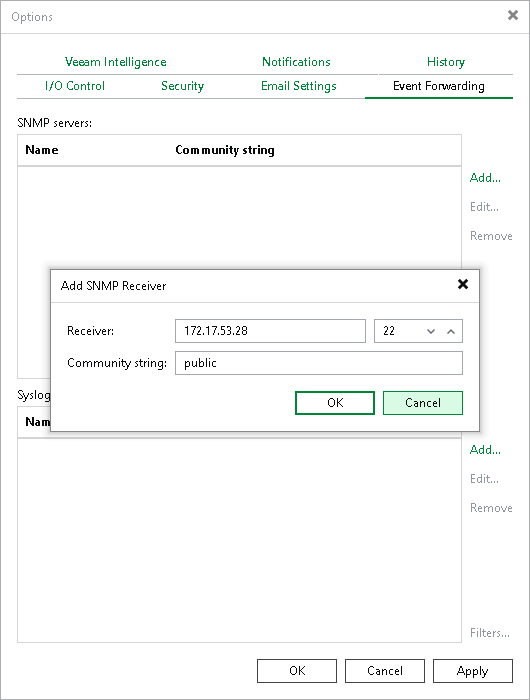

# Configuring Global SNMP Settings Using Console

To configure global SNMP settings, do the following in the Veeam Backup & Replication console:

1. From the main menu, select Options > Event Forwarding.
2. In the SNMP servers window, Click Add.
3. In the Receiver field, specify an IPv4 or IPv6 address of the SNMP recipient. Note that you can use IPv6 addresses only if IPv6 communication is enabled as described in section [IPv6 Support](ipv6.md).
4. In the field on the right, enter the port number to be used.
5. In the Community string field, enter the community identifier.

