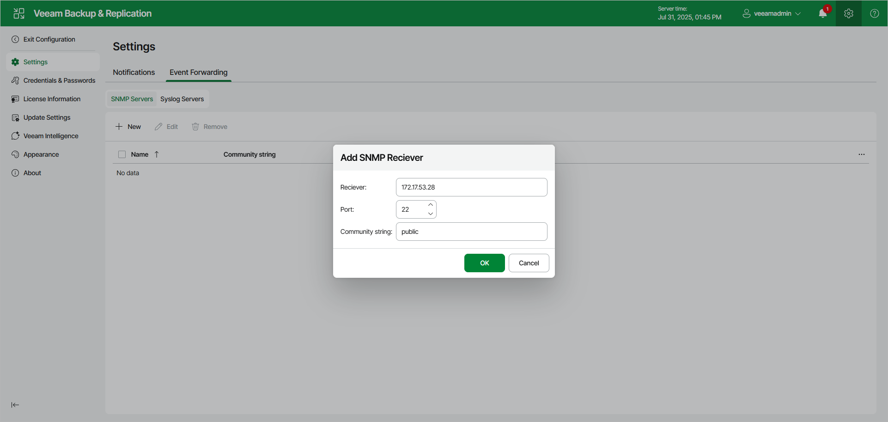

# Configuring Global SNMP Settings Using Web UI

In this article

To configure global SNMP settings, do the following in the Veeam Backup & Replication web UI:

1. Click the gear icon in the top bar.
2. Click the Event Forwarding tab.
3. In the SNMP Servers tab, click New.
4. In the Receiver field, specify an IPv4 or IPv6 address of the SNMP recipient. Note that you can use IPv6 addresses only if IPv6 communication is enabled as described in section [IPv6 Support](ipv6.md).
5. In the Port field, enter the port number to be used.
6. In the Community string field, enter the community identifier.
7. Click OK.

To edit the existing server, use the check box before the required server name, click Edit and make all necessary changes.

Page updated 7/31/2025

Page content applies to build 13.0.1.1071
