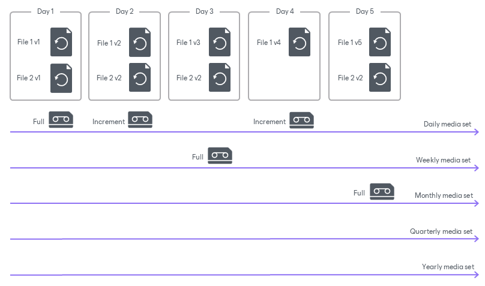

# How GFS File and Object Storage Backup to Tape Works

In this article

To create a GFS archive, Veeam Backup & Replication performs the following operations:

1. The GFS job starts according to the GFS job schedule and checks which media set is scheduled for today.
2. If some elder media sets are scheduled today, the GFS job creates a full backup for the eldest media set.

No restore points will be archived to the lower media sets.

1. If only the Daily media set is due today, the GFS job creates an incremental backup and writes it to the Daily media set.

Incremental restore points in the Daily media set are linked to a full restore point in any media set. If it is the first run of the GFS job and only the Daily media set is due today, the job creates a full backup for the Daily media set.

1. If the GFS job fails for some reason, Veeam Backup & Replication reschedules it to start again every hour until the end of the day.

Consider the following:

* If the GFS job fails on one of the next days after it was started, and some equal or elder media sets are scheduled for that next day, the job will not be retried. For example, a daily backup starts on Friday and fails on Saturday. It overlaps with the Weekly media set scheduled on Saturday. The GFS job archives the next restore point to the Weekly media set and skips the delayed daily backup.
* If one of the GFS media set backups was missed, on the next run, the GFS job checks which media set was missed. If the missed media set is elder than the one scheduled, the GFS job will archive only the missed media set.
* If you stop the tape job manually, it is rescheduled to start again within an hour.
* If you use the Daily media set, after creating or enabling a tape job it will be started within an hour even if the scheduled start time has already passed.
* If you disable the GFS tape job manually for some period, all backups for that period will be skipped from processing.

Page updated 1/15/2026

Page content applies to build 13.0.1.1071
