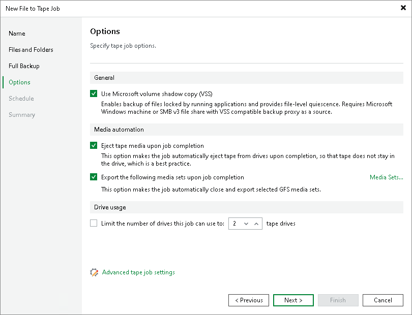

# Options for GFS File to Tape Job

This step of the wizard is available if you selected a GFS media pool at the Full Backup step of the wizard.

At the Options step of the wizard, specify archiving and media automation options:

* To enable backup of files with the help of Microsoft volume shadow copies, select the Use Microsoft volume shadow copy (VSS) check box. This option enables backup of files locked by applications and provides file-level quiescence. This feature is available for file backup from Microsoft Windows servers or SMB v3 file shares and requires a VSS compatible backup proxy.

* If you want the tape to be automatically ejected from the tape drive and placed into a slot when the job finishes, select the Eject tape media upon job completion check box.

* If you want to pull out the tapes with some specific media sets from the tape device, select the Export the following media sets upon job completion check box. You can use this option, for example, to move tapes to another storage location. The tape device will eject the tapes that belong to the selected media set.

Click Media Sets and select the media sets that you want to export.

* To limit the number of drives to use for processing the tape job, select the Limit the number of drives this job can use to N tape drives check box and specify the number of drives to use. For more information, see [Add Optional Media Pool Settings](add_media_pool_encryption.md).

