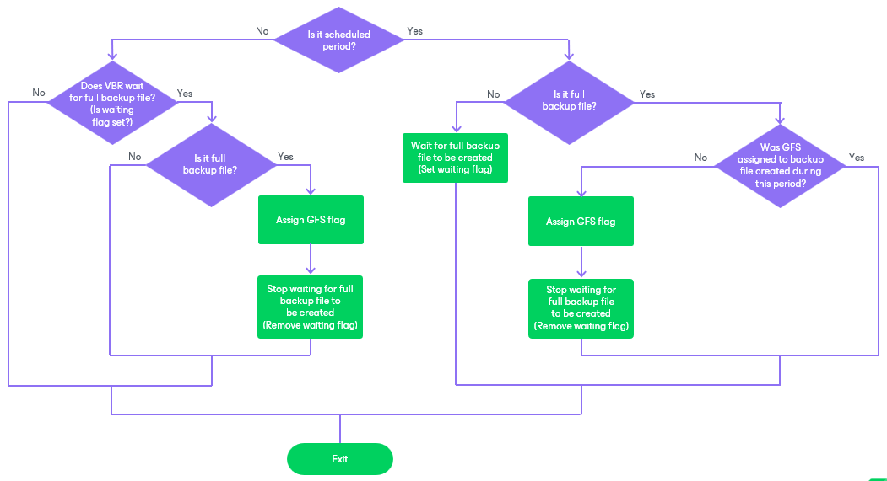
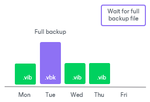
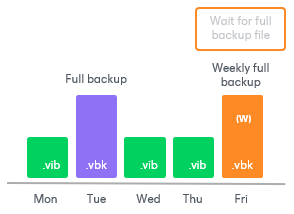
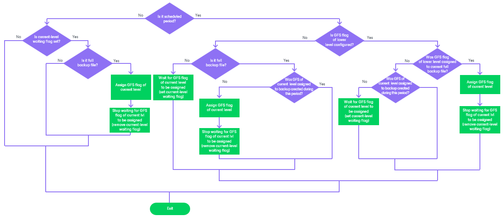
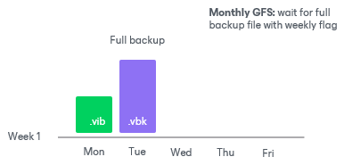
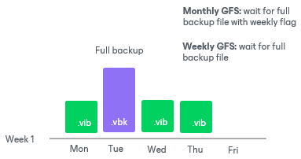
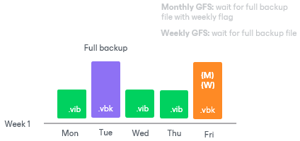

# Assignment of GFS Flags

When configuring GFS retention policy settings, you can choose a number of GFS flag types that Veeam Backup & Replication will use to mark backup files for long-term retention. Depending on this number, Veeam Backup & Replication will apply slightly different algorithms when assigning GFS flags:

* [Algorithm for One Flag Type](#single)
* [Algorithm for Multiple Flag Types](#multiple)

|  |
| --- |
| Important |
| When you reconfigure the GFS retention policy and save it, the following applies:   * If you change the amount of time for which backups with GFS flags must be kept, the previously created GFS backups will also be kept according to the new settings.  * If you change the time period when GFS flags must be assigned, the previously assigned GFS flags are not considered when determining whether new GFS flags must be assigned. |

Algorithm for One Flag Type

If you select only one type of GFS flag when configuring retention policy settings for a backup job, Veeam Backup & Replication assigns the flags depending on the scheduled period. The scheduled period is a period when a new GFS flag must be assigned and is set according to the following schema: for weekly GFS — the day selected in the [GFS retention policy settings](backup_job_gfs_vm.md); for monthly GFS — the selected week; for yearly GFS — the selected month.

Depending on the scheduled period settings, Veeam Backup & Replication performs the following steps as soon as the job finishes:

* If the job finishes within the period when a new GFS flag must be assigned (the scheduled period), Veeam Backup & Replication checks whether the backup job has created a full backup file.

* Yes, the full backup has been created: If the GFS flag has already been assigned to another backup file during the scheduled period, Veeam Backup & Replication does not assign another GFS flag to the backup file. If the GFS flag has not been assigned, Veeam Backup & Replication assigns it and stops waiting for the full backup file (removes the waiting flag).
* No, the full backup has not been created: Veeam Backup & Replication waits for a full backup file to be created (sets the waiting flag).

* If the job finishes outside the scheduled period, Veeam Backup & Replication checks whether the full backup file is being waited for (check whether the waiting flag is set).

* Yes, the waiting flag is set: Veeam Backup & Replication checks whether the backup job has created a full backup file.

* Yes: Veeam Backup & Replication assigns the GFS flag and stops waiting for the full backup file (removes the waiting flag).
* No: Veeam Backup & Replication does not assign a new GFS flag.

* No, the waiting flag is not set: Veeam Backup & Replication does not assign a new GFS flag.

Consider the following example. On Monday, you configure the GFS policy settings of a backup job in a way weekly GFS flags must be assigned every Wednesday. The following animation shows how Veeam Backup & Replication will assign the flag if a full backup file is not created on the scheduled day.

Example Description

|  |
| --- |
| 1. Until Wednesday, Veeam Backup & Replication will not assign any GFS flags because the scheduled period has not started yet. 2. On Wednesday, the backup job will produce an incremental backup file. Veeam Backup & Replication will start waiting for a full backup file to be created since the scheduled period is now started.      1. On Thursday, the backup job will produce another incremental backup file, while Veeam Backup & Replication will still be waiting for a full backup file.      1. On Friday, the backup job will produce a full backup file, and Veeam Backup & Replication will immediately assign the weekly GFS flag to the backup file.    |

Algorithm for Multiple Flag Types

If you select multiple types of GFS flags when configuring retention policy settings for a backup job, GFS flags depend on each other. Yearly flags (high level) depend on monthly flags, monthly flags depend on weekly flags, and weekly flags (low level) do not depend on any flags. This means that Veeam Backup & Replication can only assign GFS flags of a higher level to backup files with GFS flags of a lower level — this mechanism helps you save space in the backup repository.

|  |
| --- |
| Important |
| The described mechanism does not apply to a situation where you select only two types of GFS flags: yearly and weekly. If you select these two types and do not select the monthly type, Veeam Backup & Replication treats the case as if you select only one flag type. It means that flags of each type are assigned according to the [algorithm for one flag type](#single). |

Veeam Backup & Replication performs the following steps as soon as the job finishes and performs them for GFS flags of each level. Note that GFS flags of lower levels are processed before flags of higher levels. In the described algorithm, the "scheduled period" is the following: for weekly GFS — the day selected in the [GFS retention policy settings](backup_job_gfs_vm.md); for monthly GFS — the selected week; for yearly GFS — the selected month.

* If the job finishes within the period when a new GFS flag must be assigned, Veeam Backup & Replication checks whether the flag of a lower level is configured in the job settings.

* Yes, the flag of a lower level is configured: If the GFS flag of a lower level has already been assigned to the backup file created by the job, Veeam Backup & Replication assigns the GFS flag of the current level and stops waiting for the flag of the current level to be assigned (removes the current-level waiting flag). If the GFS flag of a lower level has not been assigned, Veeam Backup & Replication checks whether the GFS flag of the current level has already been assigned to another backup file during the scheduled period:

* Yes, the GFS flag of the current level has already been assigned: Veeam Backup & Replication does not assign any GFS flags.

* No, the flag has not been assigned: Veeam Backup & Replication waits for the flag of the current level to be assigned (sets the current-level waiting flag).

* No, the flag of a lower level is not configured: Veeam Backup & Replication checks whether the backup job has created a full backup file.

* Yes: If the GFS flag of the current level has already been assigned to another backup file during the scheduled period, Veeam Backup & Replication does not assign the GFS flag of the current level to the backup file. If the GFS flag has not been assigned, Veeam Backup & Replication assigns it and stops waiting for the GFS flag of the current level to be assigned (removes the current-level waiting flag).
* No: Veeam Backup & Replication waits for a full backup file to be created (sets the current-level waiting flag).

* If the job finishes outside the scheduled period, Veeam Backup & Replication checks whether the GFS flag of the current level is being waited for (checks whether the current-level waiting flag is set).

* Yes, the flag of the current level has already been assigned: Veeam Backup & Replication does not assign any GFS flags.
* No, the flag has not been assigned: Veeam Backup & Replication checks whether the backup job has created a full backup file.

* Yes: Veeam Backup & Replication assigns the flag of the current level and stops waiting for the GFS flag of the current level to be assigned (removes the current-level waiting flag).
* No: Veeam Backup & Replication does not assign any GFS flags.

Consider the following example. On Monday, you configure GFS policy settings of a backup job in a way weekly GFS flags must be assigned every Wednesday and monthly GFS flags must be assigned every first week of a month. The following animation shows how Veeam Backup & Replication will assign the flags.

Example Description

|  |
| --- |
| 1. On Monday, the backup job will produce an incremental backup file. Veeam Backup & Replication will start waiting for a full backup file since the monthly scheduled period is now started. 2. On Tuesday, the backup job will produce a full backup file. Although Veeam Backup & Replication will still be waiting for a full backup file, the full backup file with weekly GFS flag is required.      1. On Wednesday, the backup job will produce an incremental backup file. 2. On Thursday, the backup job will produce an incremental backup file. Veeam Backup & Replication will start waiting for a full backup file to assign the weekly GFS flag to it since the weekly scheduled period is now started.      1. On Friday, the backup job will produce a full backup file. Veeam Backup & Replication will immediately assign the weekly GFS flag to the backup file. As the weekly GFS flag will have been assigned, Veeam Backup & Replication will also assign the monthly GFS flag to the backup file.    |

