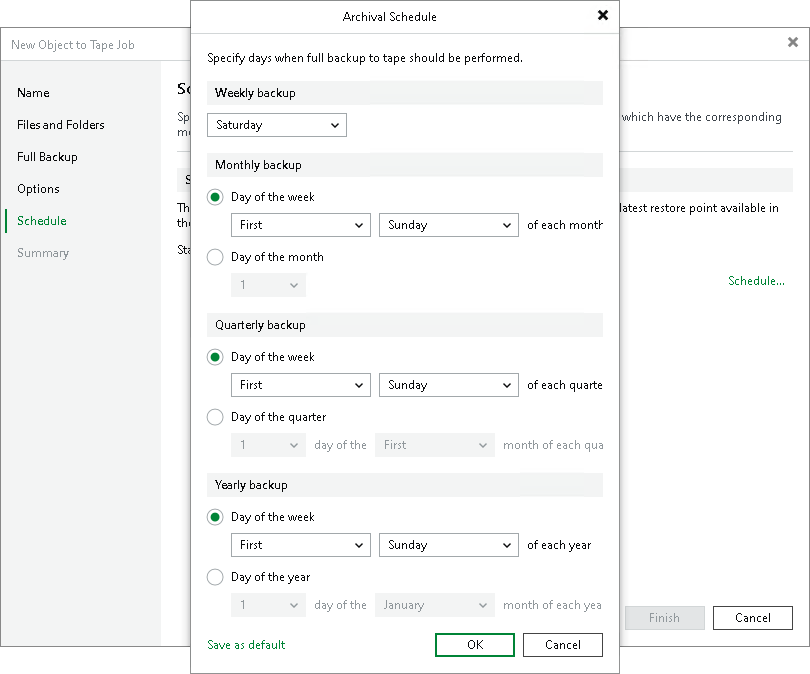
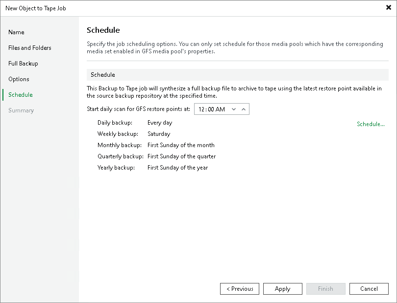

# Step 8. Define Job Schedule

This step of the wizard is available if you selected a GFS media pool at the Full Backup step of the wizard.

Click Schedule to select days for each media set.

|  |
| --- |
| Tip |
| After you specify necessary schedule settings, you can save them as default. To do this, click Save as default at the bottom left corner of the Archival Schedule window. When you create a new GFS job, Veeam Backup & Replication will automatically apply default settings to the new job schedule. |

In the Start daily scan for GFS restore points at field, specify the time when the GFS job must start. For more details on the GFS job process and scheduling settings, see [How GFS File and Object Storage Backup to Tape Works](gfs_file_to_tape_hiw.md).

