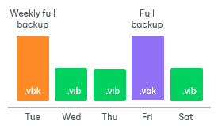

# Long-Term Retention Policy (GFS)

In this article

The long-term or Grandfather-Father-Son (GFS) retention policy allows you to store backup files for long periods of time — for weeks, months and even years. For this purpose, Veeam Backup & Replication does not create any special new backup files — it uses backup files created while the backup job runs and marks these backups with specific GFS flags.

To mark a backup file for long-term retention, Veeam Backup & Replication can assign to the file the following types of GFS flags: weekly (W), monthly (M) and yearly (Y). The types of GFS flags that Veeam Backup & Replication assigns depend on the configured [GFS retention policy settings](backup_job_gfs_hv.md). Depending on which flag is assigned to a backup, it will be stored for a specified number of weeks, months or years.

|  |
| --- |
| Important |
| Consider the following:   * GFS flags can be assigned only to [full backup files](backup_files_hv.md) created during the time period specified in GFS policy settings. * For backups located in object storage repositories, GFS flags are assigned to active full backup files that match the established GFS policy. If you enable the GFS retention policy but do not schedule active full backups, or the active full backup does not match the GFS policy, Veeam Backup & Replication will generate a synthetic full backup and assign a GFS flag to it. |

As soon as Veeam Backup & Replication assigns a GFS flag to a full backup file, this backup file can no longer be deleted or modified. Also, Veeam Backup & Replication does not apply [short-term retention policy](retention_policy_hv.md) settings to the full backup file — that is, Veeam Backup & Replication ignores the backup file when determining whether the number of allowed backup files is exceeded. For more information on how GFS flags are assigned, see [Assignment of GFS Flags](gfs_how_flags_assigned_hv.md).

When the specified retention period ends, Veeam Backup & Replication unassigns the GFS flag from the full backup file. If the backup file does not have any other GFS flags assigned, it can be modified and deleted according to the short-term retention policy. For more information on when Veeam Backup & Replication removes GFS flags, see [Removal of GFS Flags](gfs_flags_removal_hv.md).

Limitations

When planning to use GFS retention policy, consider the following limitations:

* GFS retention policy does not apply to [reverse incremental backup chains](reversed_incremental_backup_hv.md).

* GFS retention policy applies to forever forward incremental backup chain only if you periodically create full backups manually or using scheduled scripts. For more information on cmdlets that you can use in scripts, see the [Veeam PowerShell Reference](https://helpcenter.veeam.com/docs/vbr/powershell/getting_started.html?ver=13).
* If you store backups with GFS flags in the [capacity tier](capacity_tier.md) with immutability enabled, the GFS retention policy is not considered. Immutability period depends on the object storage repository settings.

* As Veeam Backup & Replication does not create new full backup files while applying the GFS retention policy, you must configure your backup jobs in a way you do not lose any essential data due to an insufficient number of full backup files. For example, if you configure monthly GFS retention, you need at least one full backup file per month.
* If a GFS flag is assigned to a full backup file in an active backup chain, Veeam Backup & Replication is not able to merge data from incremental backup files into the full backup file. For forever forward incremental backup chain, this means, that the short-term retention policy does not apply.
* Veeam Backup & Replication assigns GFS flags only after you save GFS retention policy settings. This means that GFS flags are assigned only to those backup files created after the configuration, while backup files created earlier are not affected and previously assigned flags are not modified.
* You cannot store full backups to which GFS flags are assigned in backup repositories with rotated drives.
* [Retention policy for deleted items](retention_deleted_vms_hv.md) does not apply to full backup files to which GFS flags are assigned.

Related Topics

* [Assignment of GFS Flags](gfs_how_flags_assigned_hv.md)
* [Removal of GFS Flags](gfs_flags_removal_hv.md)

Page updated 2/11/2025

Page content applies to build 13.0.1.1071
