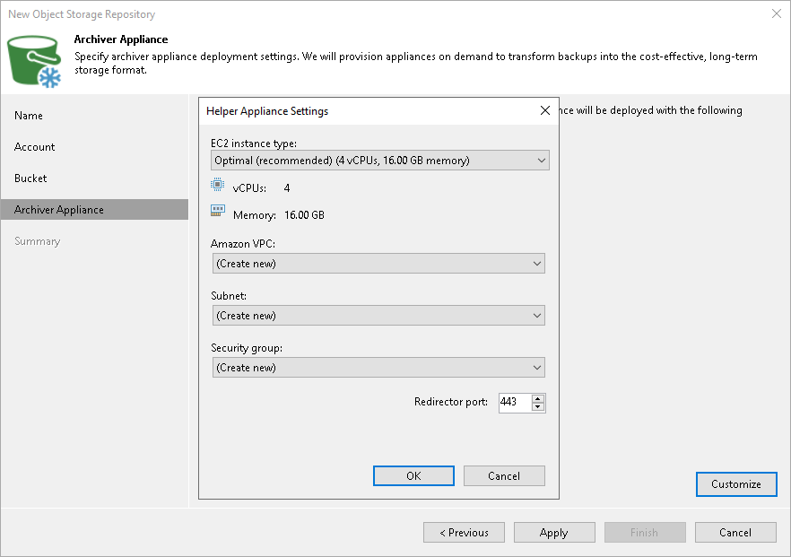

# Step 5. Specify Archiver Appliance

In this article

At the Archiver Appliance step of the wizard, you can specify the archiver appliance settings. An archiver appliance is an auxiliary instance that is necessary for transferring the data to Amazon S3 Glacier. For more information, see the [Archiver Appliances](archiver_appliance.md) section.

|  |
| --- |
| Important |
| Consider the following:   * Make sure the archiver appliance does not transfer data to the archive tier over NAT gateway server since it might result in high costs. If NAT server is necessary, consider setting up a gateway endpoint. For more information on setting up a gateway endpoint, see this [AWS Documentation](https://docs.aws.amazon.com/vpc/latest/privatelink/vpc-endpoints-s3.html). For more information on pricing, see this [AWS Documentation](https://aws.amazon.com/vpc/pricing/).  * You must configure the archiver appliance if you transfer data from [Microsoft Azure Blob Storage](osr_adding_blob_storage.md), [Amazon S3 Storage](osr_amazon_adding.md) or [11:11 Cloud Object Storage Repository](adding_1111.md). * Veeam Backup & Replication must be able to connect to the machine that you will use as an archiver appliance. Therefore, if your backup server is not located within AWS, you must configure public IP addresses for the subnet in which the appliance resides. For more information on configuring the subnet for Amazon VPC, see [AWS Documentation](https://docs.aws.amazon.com/vpc/latest/userguide/modify-subnets.html#subnet-public-ip). |

You can specify archiver appliance in one of the following ways:

* Use the default settings. In that case, Veeam Backup & Replication will select the necessary settings from those available in your account, or will create for you new settings for the EC2 instance type, Amazon VPC, subnet, security group and redirector port.

|  |
| --- |
| Important |
| Veeam Backup & Replication creates a default security group with the inbound rules that allow connection using the 443 and 22 ports from everywhere (0.0.0.0/0). |

* Specify the settings manually:

1. Click Customize.
2. From the EC2 instance type drop-down list, select the instance type for the proxy appliance. The EC2 instance type affects the speed and the cost of transferring the backup files to the [Archive Tier](archive_tier.md) of a scale-out backup repository. For information on instance types, see [AWS Documentation](https://aws.amazon.com/ec2/instance-types/).  For details on the EC2 instant types used by Veeam Backup & Replication, see [this Veeam KB article](https://www.veeam.com/kb4317).
3. From the Amazon VPC drop-down list, select the Amazon VPC where Veeam Backup & Replication will launch the target instance. For information on the Amazon VPC, see [AWS Documentation](https://docs.aws.amazon.com/vpc/latest/userguide/what-is-amazon-vpc.html).
4. From the Subnet drop-down list, select the subnet for the proxy appliance.
5. From the Security group drop-down list, select a security group that will be associated with the proxy appliance. For information on security groups for Amazon VPC, see [AWS Documentation](https://docs.aws.amazon.com/vpc/latest/userguide/VPC_SecurityGroups.html).
6. In the Redirector port field, specify the TCP port that Veeam Backup & Replication will use to route requests between the proxy appliance and backup infrastructure components.
7. Click OK.

Page updated 9/4/2025

Page content applies to build 13.0.1.1071
