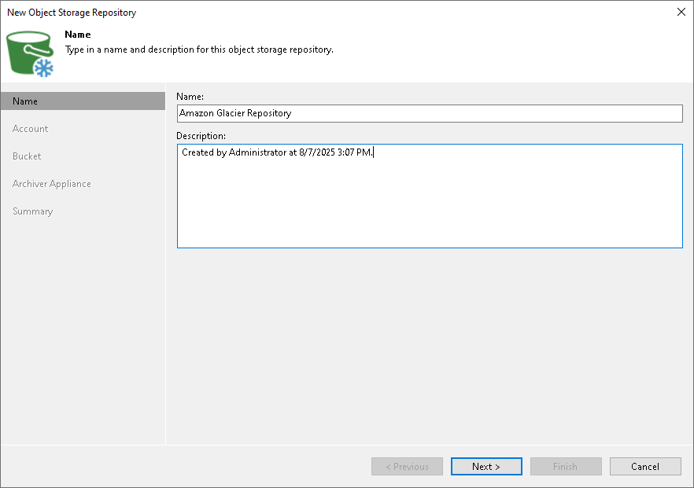

# Step 2. Specify Object Storage Name

At the Name step of the wizard, use the Name and Description fields to enter a name for the new object storage repository and to provide a description for future reference.

