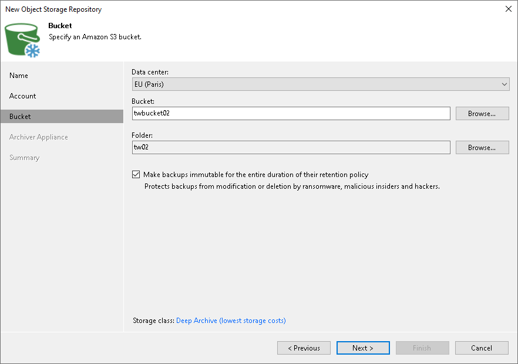
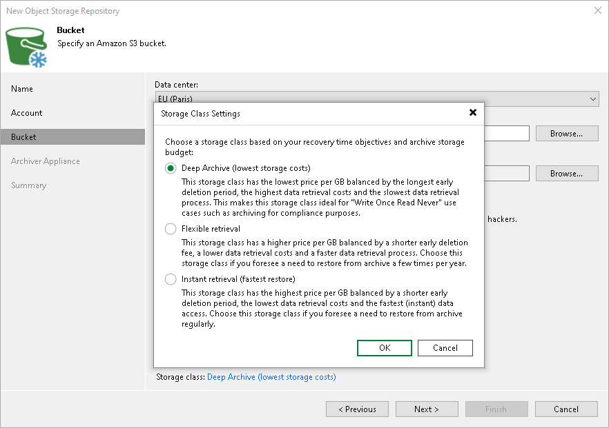

# Step 4. Specify Object Storage Settings

At the Bucket step of the wizard, specify Amazon S3 bucket and folder that will be used to store data:

1. From the Data center drop-down list, select the AWS region where the Amazon S3 bucket is located.
2. In the Bucket field, enter a name of the bucket or click Browse to get the necessary bucket.

|  |
| --- |
| Important |
| You must create the bucket where you want to store your backup data beforehand. When you create a bucket, consider Amazon bucket naming rules. It is not recommended that you use dots (.) in the bucket name. For more information on bucket naming rules, see [AWS Documentation](https://docs.aws.amazon.com/AmazonS3/latest/userguide/bucketnamingrules.html). |

If the FIPS-compliant operation mode is enabled and the bucket you want to add is non-FIPS compliant, the warning will be displayed. For more information, see [FIPS Compliance](fips_compliance.md).

1. To the right of the Folder field, click Browse and either select an existing folder or click New Folder.
2. To prohibit deletion of blocks of data from object storage, select the Make backups immutable for the entire duration of their retention policy check box. The immutability period will be equal to the retention period (if any) of the data blocks. All the types of files that are eligible for archive storage can be made immutable. For more information on the immutability feature and the retention policy for each file type, see [Immutability for Archive Tier](immutability_archive_tier.md).

Keep in mind that to use immutability, you must enable the Object Lock and Versioning features on your S3 bucket at the time when you create the bucket. For more information, see [Enabling Immutability](immutability_os_enable.md).

Specifying Amazon S3 Storage Classes

To specify the Amazon S3 storage class that you want to enable for your bucket, click the Deep Archive link to the right of the Storage class field. In the Storage Class Settings window, select one of the following:

* Select the Deep Archive option to assign the Amazon S3 Glacier Deep Archive storage class to data blocks. Use this option if you want to keep data for more than 7 years and do not plan to access it.

Note that to get data from this type of a backup, you must first retrieve data from Archive Tier. For more information, see [Restore from Archive Tier](restore_archive_tier.md).

* Select the Flexible retrieval option to assign the Amazon S3 Glacier Flexible Retrieval storage class to data blocks. Use this option if you want to access data in infrequent manner.

Note that to get data from this type of a backup, you must first retrieve data from Archive Tier. For more information, see [Restore from Archive Tier](restore_archive_tier.md).

* Select the Instant retrieval option to assign the Amazon S3 Glacier Instant Retrieval storage class to data blocks. Use this option if you plan to access your backup data immediately. In this case, you do not need to retrieve data from Archive Tier and can immediately initiate any type of the [data recovery](data_recovery.md) operation.

For more information on Amazon S3 archive storage classes, see [AWS Documentation](https://aws.amazon.com/s3/storage-classes/?nc1=h_ls#Archive).

Related Topics

* [Immutability for Archive Tier](immutability_archive_tier.md)
* [Immutability for Scale-Out Backup Repositories](immutability_sobr.md)

