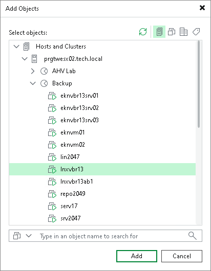
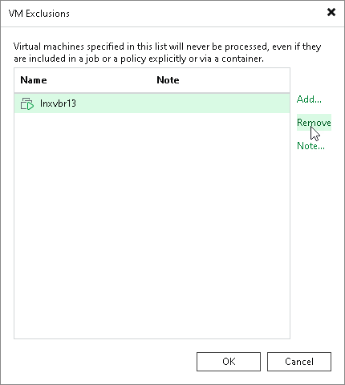

# Configuring Global VM Exclusions

Global VM exclusion allows you to stop processing VMs even if they are included in jobs. When excluding VMs globally, you do not need to change job settings. Global exclusion applies to all types of jobs that process VMs except backup copy jobs and SureBackup jobs. Note that if Veeam Backup & Replication has started to process a VM at the moment when you exclude the VM from processing, Veeam Backup & Replication finishes processing and only then excludes the VM.

At any moment, you can enable processing of VMs so that jobs will continue processing the VMs.

|  |
| --- |
| Important |
| Note that you can exclude only VMs from processing. It is not possible for VM containers such as:   * Folders * Resource pools * VirtualApps * Datastores * Tags * SCVMM * SCVMM tags * SCVMM host groups * VM groups * Volumes |

Excluding VMs from Processing

To exclude VMs globally, do the following:

1. From the [main menu](vbr_ui.md#main_menu), select Global Exclusions > VM Exclusions.
2. In the VM Exclusions window, click Add.
3. In the Add Objects window, select VMs that you want to exclude from processing. Click Add.
4. If you want to add a note why a VM is excluded from processing, select a VM from the list and click Note. In the Edit Note window, enter the note text. Click OK.

Alternatively, you can open the Inventory view and switch to the required view. In the working area, select the VMs that you want to exclude, right-click one of them and select Disable processing. In the Inventory view, VMs excluded from processing will be displayed with the  icon.

Resuming VM Processing

To resume processing for VMs, do the following:

1. From the [main menu](vbr_ui.md#main_menu), select VM Exclusions.
2. In the VM Exclusions window, select VMs for which you want to resume processing.
3. Click Remove.

Alternatively, you can open the Inventory view and switch to the required view. In the working area, select the VMs that were excluded from processing, right-click one of them and select Disable processing.

