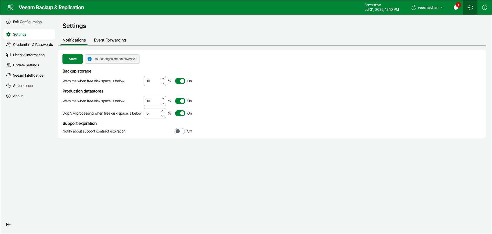

# Specifying Global Notification Settings Using Web UI

In this article

In Veeam Backup & Replication web UI, you can configure Veeam Backup & Replication to automatically notify you about the following events:

* [Low disk space](#space)
* [Support contract expiration](#support)

Low Disk Space Notification

When you run a job, Veeam Backup & Replication checks disk space in the target backup repository and production storage. If the disk space is less than a specific value, Veeam Backup & Replication will display a warning message in the job session details.

To specify the disk space threshold, do the following in the Veeam Backup & Replication web UI:

1. At any screen, click the gear icon in the top bar.
2. Click the Notifications tab.
3. In the Backup storage and Production datastores sections, set the Warn me when free disk space is below <N> % options to On and specify a desired disk space threshold.
4. In the Production datastores section, set the Skip VM processing when free disk is below <N> % option to On and specify a desired disk space threshold. When the threshold is reached, Veeam Backup & Replication will terminate backup and replication jobs working with production datastores or volumes before snapshots and checkpoints are taken. Such behavior helps ensure that production datastores and volumes do not run out of space.

Veeam Backup & Replication also terminates jobs if the amount of free space on the datastore or volume is less than 2 GB. You can change this threshold limit in the in the configuration file on the Linux-based backup server or with a registry value on the Microsoft Windows-based backup server. For more information, see [this Veeam KB article](https://www.veeam.com/kb4379).

1. Click Save.

Support Contract Expiration Notification

By default, Veeam Backup & Replication informs email recipients specified in global notification settings about the support expiration date in every email notification. Veeam Backup & Replication starts sending such notifications 14 days before the expiration date. Expiration information is also shown on the splash screen and on the License Information window (to display the License Information window, select Help > License from the main menu).

To stop receiving notifications about support contract expiration, do the following in the Veeam Backup & Replication web UI:

1. Click the gear icon in the top bar.
2. Click the Notifications tab.
3. In the Support expiration section, set the Notify about support contract expiration option to Off.
4. Click Save.

Page updated 11/14/2025

Page content applies to build 13.0.1.1071
