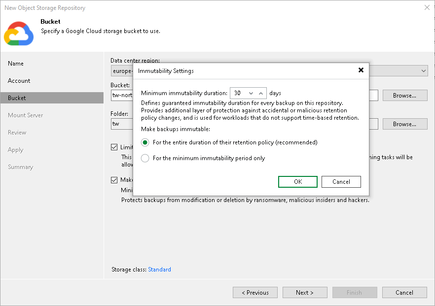
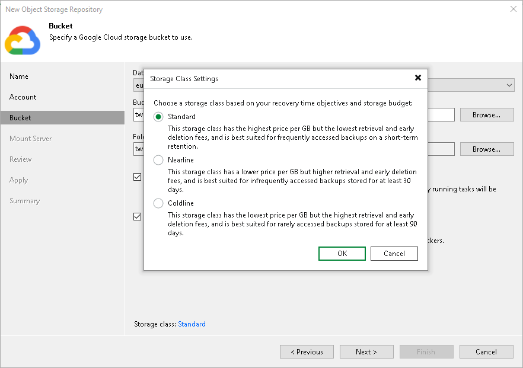

# Step 4. Specify Object Storage Settings

At the Bucket step of the wizard, do the following:

1. [Specify general settings for a bucket](#bucket).
2. [Specify immutability settings](#immutability).
3. [Specify the storage class](#storageclass).

Specifying General Settings Bucket

To specify general settings for the bucket:

1. From the Data center region drop-down list, select a region.
2. In the Bucket field, enter a name of the bucket or click Browse to get the necessary bucket.

Note that you must create the bucket where you want to store your backup data beforehand.

1. In the Folder field, enter a cloud folder name to which you want to map your object storage repository. Alternatively, click Browse and either select an existing folder or click New Folder.

1. Select the Limit object storage consumption to check box to define a soft limit for your object storage consumption. If this limit is exceeded during a job run, Veeam Backup & Replication will complete the job. However, a new job will not be able to start unless you remove the extra data that exceeds the limit or change the soft limit settings. Provide the value in TB or PB.

Specifying Immutability Settings

Immutability prohibits deletion of blocks of data from your object storage repository.

To enable immutability:

1. Select the Make backups immutable (recommended) check box.
2. In the Immutability Settings window, specify how the immutability period is counted and set the immutability period in days:

* Select the For the entire duration of their retention policy option if you want the immutability period depend on the retention policy of a backup job.

|  |
| --- |
| Important |
| Consider the following:   * If the job retention exceeds the immutability period, the actual retention is counted as job retention policy + Block Generation period. * If the immutability period exceeds the job retention period, the actual retention is counted as immutability period + Block Generation period. * The default immutability period is 30 days. You can set the immutability period to different values in the Veeam Backup & Replication UI. The minimum immutability period is 1 day, and the maximum is 999 days.   For more information, see [How Immutability Works](hiw_immutability_os.md). |

* Select the For the minimum immutability period only option if you want to specify the immutability period explicitly. The backup job retention will be skipped.
* Next to the Minimum immutability duration option, provide the necessary value.

Specifying Storage Class Settings

The storage class defines how your data is stored and managed in the bucket, affecting cost, availability, and access frequency. For more information on Google Cloud object storage classes, see [Google Documentation](https://cloud.google.com/storage/docs/storage-classes).

To specify the storage class, do the following:

1. Click the Standard link to the right of the Storage class field.
2. In the Storage Class Settings window, select one of the following:

* Standard: Use this option if you plan to access your data frequently and store it for a short period of time.
* Nearline: Use this option if you plan to access data infrequently (for example, once a month or less) and store it for at least 30 days.
* Coldline: Use this option if you plan to access data rarely (for example, once a quarter) and store it for at least 90 days.

