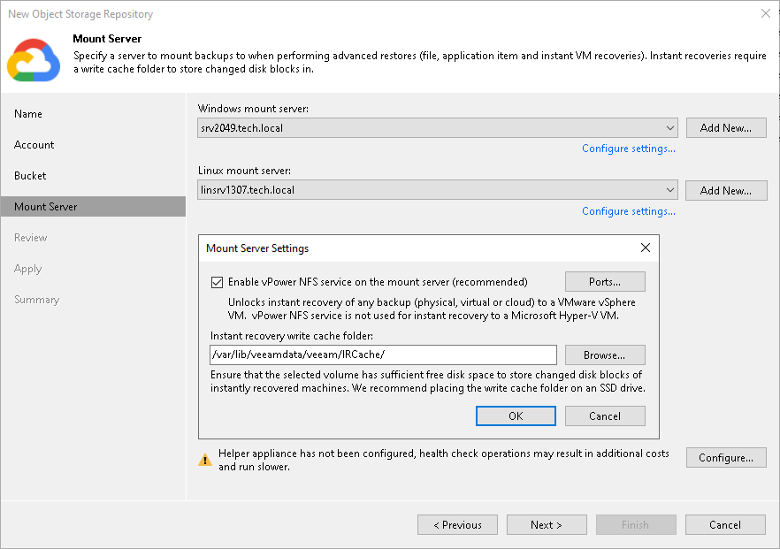
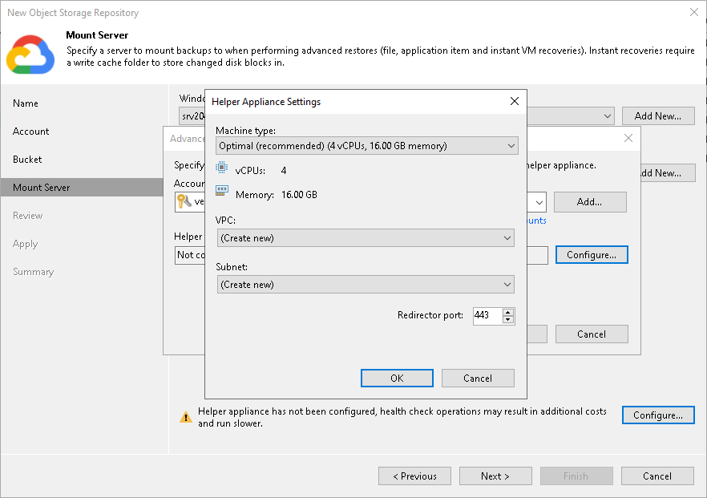

# Step 5. Specify Mount Server Settings

At the Mount Server step of the wizard, specify settings for the mount server that you plan to use for restore operations, and configure a helper appliance. The helper appliance is a temporary VM instance that Veeam Backup & Replication deploys in Google Compute Engine to perform a health check of backup files and apply retention to unstructured data backup files. For more information, see [Health Check for Object Storage Repositories](health_check_os.md) and [Helper Appliance in Unstructured Data Backup](unstructured_data_backup_in_object_storage.md#helper). After Veeam Backup & Replication completes these operations, it removes the helper appliance from Google Compute Engine.

Specifying Mount Server Settings

Specifying Mount Server Settings for VMware vSphere Platform

To specify the mount server settings, do the following:

1. From the Windows mount server drop-down list, select a server that you want to use as a Windows-based mount server. Veeam Backup & Replication uses this server during restore operations to mount VM disks directly from objects located in object storage repositories. For more information, see [Mount Servers](mount_server.md).

The Windows mount server list contains only Microsoft Windows servers that are added to the backup infrastructure. If the server is not added to the backup infrastructure yet, click Add New on the right to open the New Windows Server wizard. For more information, see [Adding Microsoft Windows Servers](add_windows_server.md).

1. From the Linux mount server drop-down list, select a server that you want to use as a Linux-based mount server. Veeam Backup & Replication uses this server during restore operations to mount VM disks directly from objects located in object storage repositories. For more information, see [Mount Servers](mount_server.md).

The Linux mount server list contains only RHEL/Rocky-based Linux servers that are added to the backup infrastructure. If the server is not added to the backup infrastructure yet, click Add New on the right to open the New Linux Server wizard. For more information, see [Adding Linux Servers](add_linux_server.md).

1. Click Configure settings to configure other settings for the selected mount servers:

1. Select the Enable vPower NFS service on the mount server check box to allow the Veeam vPower NFS Service access the object storage repository. Veeam Backup & Replication will enable the Veeam vPower NFS Service on the necessary mount server. For more information, see [Veeam vPower NFS Service](vpower_nfs_service.md).

|  |
| --- |
| Important |
| Consider the following:   * vPower NFS settings are not applicable in Microsoft Hyper-V environments. * Do not enable Microsoft Windows NFS services on the machine where you install the Veeam vPower NFS Service. If Microsoft NFS services and Veeam vPower NFS Service are enabled on the same machine, both services may fail to work correctly. |

1. Click Ports to customize network ports used by the Veeam vPower NFS Service. In the vPower NFS Port Settings window, specify the following settings:

* Next to the Mount Port section, specify the port that the Veeam vPower NFS Service will use to mount the vPower NFS datastore to the ESXi host.
* Next to the vPower NFS port section, specify the port that the Veeam vPower NFS Service will use to connect to the target NFS share.

For information on ports used by default, see [Ports](used_ports.md).

1. In the Instant recovery write cache folder field, specify a folder to keep cache that is created during mount operations.

1. To specify the helper appliance settings, click Configure. From the Managed server drop-down list, select a server that you want to use as the helper appliance.

Configuring Helper Appliance

To configure the helper appliance, at the Mount Server step, click Configure and in the Advanced Settings window, specify the following settings:

1. From the Account drop-down list, select a credentials record to access your Google Cloud object storage. Veeam Backup & Replication will use this credentials record to connect to Google Compute Engine within Google Cloud and create the helper appliance.

If you have not added the credentials record beforehand, click Manage cloud accounts or Add to add the necessary service account. For more information, see [Google Cloud Service Accounts](cloud_credentials_gcp.md).

1. Next to the Helper appliance field, click Configure. In the Appliance Settings window, specify the following settings:

1. From the Machine type drop-down list, select the machine type for the helper appliance. The speed and cost of operations that the helper appliance performs depend on the machine type. For information on instance types, see [Google Cloud documentation](https://cloud.google.com/compute/docs/machine-types).

1. From the VPC drop-down list, select a VPC network where a helper appliance will be launched. For more information on VPC networks, see [Google Cloud documentation](https://cloud.google.com/vpc/docs/vpc).

To be able to select the necessary VPC from the drop-down list, you must create it beforehand as described in the [Google Cloud documentation.](https://cloud.google.com/vpc/docs/create-modify-vpc-networks).

1. From the Subnet drop-down list, select a subnet where a helper appliance will reside. For more information on subnets, see [Google Cloud documentation](https://cloud.google.com/vpc/docs/subnets).

To be able to select the subnet from the drop-down list, you must create it beforehand as described in the [Google Cloud documentation](https://cloud.google.com/vpc/docs/create-modify-vpc-networks#subnet-rules).

1. In the Redirector port field, specify the TCP port that Veeam Backup & Replication will use to route requests between the helper appliance and backup infrastructure components.

