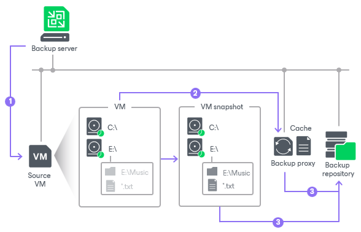

# VM Guest OS Files

If you do not want to back up or replicate some files and folders on the VM guest OS, you can exclude them from the backup or replica. File exclusion reduces the size of the backup or replica but may affect job performance.

You can specify file exclusion settings granularly for every VM in the job or for the whole VM container. In the latter case, Veeam Backup & Replication will apply the configured rule to all VMs in this container.

To define which VM guest OS files must and must not be processed, you can use the following options:

* Disable file exclusion.

Veeam Backup & Replication will back up or replicate the whole content of the VM guest file system.

* Exclude specific files and folders from the backup or replica.

Veeam Backup & Replication will back up or replicate all files and folders except the specified ones.

* Include only specific files and folders in the backup or replica.

Veeam Backup & Replication will back up or replicate only the specified files and folders.

Defining File Exclusions and Inclusions

To define a list of exclusions or inclusions, you can use the following methods:

* Specify a full path to a folder on the VM guest OS, for example, C:\Documents\.
* Specify a full path to a file on the VM guest OS, for example, C:\Documents\MyReport.docx.

If a path is not full, Veeam Backup & Replication will expand it to the root directory on the computer volume and attempt to detect such files on all computer volumes. For example, you have C, D and E disks on the VM. In the list of exclusions, you specify Document.docx. Veeam Backup & Replication will scan the whole file system and exclude the following files (if any): C:\Document.docx, D:\Document.docx, E:\Document.docx. If there is a C:\MyDocuments\Document.docx file, it will not be excluded — this file is not located in the root directory.

* Use environmental variables, for example, %TEMP%, %windir%.

Environment variables must be defined for the user account that you use to connect to the VM guest OS and under which the non-persistent runtime components or persistent agent components are started. For example, you connect to the VM guest OS under the Administrator account. If you want to use the %windir% variable in the list of exclusions or inclusions, you must ensure that the %windir% variable is added to the list of user variables for Administrator on the VM guest OS.

* Use file masks. You can use the following characters for masks:

+ (\*) — a substitution for one or more characters in the file name or path. It can be used for any sequence of characters (including no characters). For example, \*.pdf.
+ (?) — a substitution of one character in the file name or path. For example, repor?.pdf.
+ (;) — mask separator, for example, report.\*;reports.\*.

In the following table, the mask stands for any sequence of characters.

| Mask format | Affects paths/files |
| --- | --- |
| \*mask\* | All paths that contain the given sequence. |
| mask\* | If the asterisk character (\*) is not specified at the beginning of the mask, the mask will be applied to all volumes on the VM guest OS, and Veeam Backup & Replication will include/exclude files and folders in the root folder on the volume: A:\mask\*, B:\mask\*, …, Z:\mask\*. |
| <drive\_letter>:\\*mask\* | All paths on the specified volume that contain the given sequence. |
| \*mask1\*;\*mask2\*;\*mask3\* | All paths that contain at least one of the given character sequences: \*mask1\* or \*mask2\* or \*mask3\*. |

Requirements and Limitations for VM Guest OS File Exclusion

VM guest OS files exclusion has the following limitations:

* File exclusion works only on Microsoft Windows NTFS.
* The availability of the file exclusion feature depends on the license you use. For more details about licensing support, see [Veeam Data Platform Feature Comparison](https://www.veeam.com/veeam_data_platform_feature_comparison_ds.pdf).
* To exclude VM guest OS files, Veeam Backup & Replication must be able to deploy the non-persistent runtime components or use (in necessary, deploy) persistent agent components inside the VM. For this reason, the VM must be running and accessible by an IP address or through the Installer Service on VM, and credentials for application-aware processing must be valid.
* Veeam Backup & Replication supports both basic and dynamic disks. For the dynamic disks, simple type of volumes is supported. Spanned, mirrored and striped volumes are not supported.
* It is not recommended that you use VM guest files exclusion in Microsoft Windows for volumes with enabled Data Deduplication. If you decide to use VM guest files exclusion for such volumes and set up a list of inclusions, you must add the System Volume Information folder to the list of inclusions.

Consider the following:

* Be careful when using masks with double wildcard characters. If you specify masks of such type, Veeam Backup & Replication will exclude all files and paths that contain the given mask. For example, if you specify the \*.doc\* mask, Veeam Backup & Replication will exclude files like MyReport.docx, Report.doc.txt and so on.
* If you use file masks for file exclusion, Veeam Backup & Replication will scan the VM guest file system, and thus the time of VM disk processing will increase.
* The number of entries in the list of exclusions or inclusions must not exceed a few hundreds. The number of entries in the list influences the job performance — the more files are included or excluded from the backup or replica, the more time Veeam Backup & Replication requires to process these files.
* It is recommended that you do not exclude system files without the necessity. Veeam Backup & Replication does not perform any checks to verify the VM image integrity.
* Exclusion of small files (less than 2 KB in size) is ineffective and will not reduce the size of the backup or replica significantly.

Exclusion Rules for VMs with Several Volumes

The VM guest file exclusion and inclusion functionality works at the volume level. Consider the following situations:

Data exclusion

A VM has several volumes: C:\, D:\ and E:\. You want to exclude from the backup the Archive files and folders that are present at the root folder on all volumes of the VM. If you add the C:\Archive folder to the list of exclusions, Veeam Backup & Replication will back up the following data:

* Whole content of the C:\ volume except the Archive folder
* Whole content of D:\ and E:\ volumes

To exclude the Archive files and folders from the root folder from all volumes of the VM, you must Archive\* to the list of exclusions.

Data inclusion

A VM has several volumes: C:\, D:\ and E:\. You want to include to the backup only the D:\Documents folder. If you add the D:\Documents folder to the list of inclusions, Veeam Backup & Replication will back up the following data:

* D:\Documents folder
* Whole content of C:\ and E:\ volumes

To include only the D:\Documents folder to the backup, you must add the D:\Documents folder to the list of inclusions and, additionally, exclude unnecessary disks (that contain C:\ and E:\ volumes) at the Virtual Machines step of the wizard. For more information, see [Exclude Objects from Backup Job](backup_job_excludes_hv.md).

How VM Guest OS File Exclusion Works

When you exclude VM guest OS files from the backup or replica, Veeam Backup & Replication performs the following operations:

1. Veeam Backup & Replication checks the job settings to identify what VM guest OS files must be excluded.
2. Veeam Backup & Replication opens the MFT file from the VM guest file system in the memory cache on the backup proxy, and marks data blocks of excluded files as deleted.
3. When Veeam Backup & Replication copies VM data to the target, it reads data both from the VM snapshot and memory cache on the backup proxy. On the target, Veeam Backup & Replication creates a "merged" version of VM disks that do not contain excluded VM guest OS files. Due to data compression, data blocks that are marked as deleted are compressed, and the size of the resulting backup or replica file reduces.

During the job session with file exclude, Veeam Backup & Replication makes changes to processed VM disks at the NTFS level using the cache on the backup proxy. However, these changes are not visible to the CBT mechanism. For this reason, Veeam Backup & Replication saves information about excluded data blocks in the backup file and replica metadata. During the next job session with use of CBT, Veeam Backup & Replication retrieves a list of data blocks that were excluded during the previous job session from the backup file or replica metadata and analyzes what data needs to be processed during the current job session. To do this, Veeam Backup & Replication regards the following data:

* Data blocks that are marked as new with CBT
* Data blocks that were excluded during the previous job session
* Data blocks that must be excluded during the current job session

