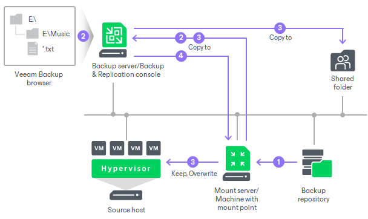

# Guest OS File Restore

With guest OS file restore, you can recover individual guest OS files and folders. When you recover files or folders, you do not need to extract the image of a workload to a staging location or start the workload prior to recovery. You can recover files and folders directly from a regular image-level backup or replica to the necessary point in time.

Supported Sources

You can recover files from the following types of data:

* Backups
* Replicas
* Storage snapshots

You can recover files to the original or new location, access recovered files, launch application item restore for the files or perform other operations. For more information, see [Finalize Recovery](guest_restore_save.md).

For the list of supported file systems, see [Supported Platforms, Applications and Workloads](platform_support.md#flr).

Mount Servers

When you perform guest OS file restore, Veeam Backup & Replication provides the following options for mounting disks from the backup, replica or snapshot:

* Helper appliance. The helper appliance is a helper VM running a stripped-down Linux kernel that has a minimal set of components. The appliance is quite small (around 50 MB) and requires 2048 MB RAM and 2 CPUs.
* Mount server (Microsoft Windows or Linux). You can select the default mount server or a mount server associated with a repository.
* Linux helper host. You can select a Linux server added to the backup infrastructure or a server not present in the backup infrastructure. We recommend you to specify the same server as the recovery target. This will improve the performance.

For more information on how a mount server is selected automatically, see [Mount Server Automatic Selection](guest_restore_scenarios.md).

Installed Services

To recover guest OS files or folders from Microsoft Windows workloads over the network, Veeam Backup & Replication installs the Veeam Installer Service, the Veeam Open SSL FIPS module and the Veeam Transport. If these services were already installed on the workload in Veeam Backup & Replication version 12 or earlier, you must remove them before performing recovery. After recovery is complete, the services remain installed on the workload.

How Recovery of Microsoft Windows Workloads Works

During the guest OS file restore, Veeam Backup & Replication performs the following operations:

1. [If mount server is helper appliance] Veeam Backup & Replication deploys the helper appliance on the host in the virtual infrastructure.
2. Veeam Backup & Replication creates a mount point on the mount server and mounts workload disks from the backup or replica to it. For more information on automatically selected mount servers, see [Mount Server Automatic Selection](guest_restore_scenarios.md).

If a workload has ReFS disks, Veeam Backup & Replication uses virtual hard disk (VHD) mount to access the content of all disks. If a workload does not have ReFS disks, Veeam Backup & Replication uses a separate program — Virtual Disk Driver (VDK) that is provided with the product. Workload disks are not physically extracted from the backup file or workload replica. Veeam Backup & Replication emulates their presence on the backup server or Veeam Backup & Replication console. The backup file or workload replica itself remains in the read-only state.

1. Veeam Backup & Replication launches the Veeam Backup browser on the Veeam Backup & Replication console. The Veeam Backup browser shows the content of disks mounted to the mount server.

You can browse the workload guest file system in the Veeam Backup browser and recover files or folders to the original or new location.

1. Depending on which recovery command you use, the operations differ:

* Restore > Keep or Restore > Overwrite command: recovers files to the original location.

The mount server connects to the workload over the network, or VIX API/vSphere Web Services or PowerShell Direct if a connection over the network cannot be established.

* Restore > Permissions only command: recovers permissions.

The mount server connects to the workload over the network.

* Restore to > Keep or Restore to > Overwrite command: recovers files to a new workload.

The mount server connects to the workload over the network, or VIX API/vSphere Web Services or PowerShell Direct if a connection over the network cannot be established.

* Copy to command: recovers files to the Veeam Backup & Replication console or a shared folder.

The mount server connects to the Veeam Backup & Replication console over the network. If you recover files to a shared folder, the Veeam Backup & Replication console also connects to this folder over the network.

* Restore changed only command: recovers changes.

When recovery is launched, the mount server connects to the workload over network.

PowerShell Direct is used for VMs that reside on Microsoft Hyper-V Server 2016 (or later) and run Microsoft Windows 10 (or later) or Microsoft Windows Server 2016 (or later). Veeam Backup & Replication requires Microsoft PowerShell 2.0 (or later) to work over PowerShell Direct.

1. When the recovery process is finished or the Veeam Backup browser is closed by timeout, Veeam Backup & Replication removes all the created mount points.

When you perform guest OS file restore, you can also open files in Microsoft Windows explorer to view file content. In this case, Veeam Backup & Replication creates an additional mount point on the Veeam Backup & Replication console. For more information on how to view file content, see [Open Files in Microsoft Windows Explorer](guest_restore_save.md#explorer).

How Recovery of Linux Workloads Works

When you perform guest OS file restore, Veeam Backup & Replication performs the following operations:

1. [If mount server is helper appliance] Veeam Backup & Replication deploys the helper appliance on the host in the virtual infrastructure.
2. Veeam Backup & Replication mounts disks of a workload from the backup or replica to the mount server. The backup file or replica itself remains in the read-only state in the backup repository, datastore or volume.
3. Veeam Backup & Replication launches the Veeam Backup browser where mounted disks are displayed. You can browse the guest file system in the Veeam Backup browser and recover files or folders to the original workload or to another location. Also, you can enable an FTP server on the virtual appliance and allow workload owners to recover files themselves.
4. The operations differ depending on which recovery command you use:

* Restore or Restore to command: recovers files to the original location or to another workload of the same platform.

If you have installed the [Linux Management Agent](persistent_agent_components.md), the mount server connects to the workload to which you recover files (target workload) using this agent and recovers files. This is the preferred way of connection.

[For VMware vSphere] If the backup server fails to connect to the Management Agent, the backup server connects to the target workload over SSH. If the SSH connection also fails, Veeam Backup & Replication uses networkless processing over VIX API/vSphere Web Services. Then, Veeam Backup & Replication deploys on the workload a temporary agent that performs recovery.

[For Microsoft Hyper-V] If the backup server fails to connect to the Management Agent, the backup server connects to the target workload over SSH. Then Veeam Backup & Replication deploys on the workload a temporary agent that performs recovery.

|  |
| --- |
| Note |
| The backup server uses SSH to connect to the target machine and perform recovery if the following conditions are met:   * You use the Restore to command. * The target machine is a member of a protection group for pre-installed Veeam Agents. |

* Copy to command: recovers files to a new location.

The mount server connects to the workload to which you recover files (target workload) over SSH. Then Veeam Backup & Replication deploys on the workload the agent that performs recovery.

1. When you close the Veeam Backup browser or it is closed by timeout, Veeam Backup & Replication unmounts the content of the backup file or replica from the mount server.
2. [If mount server is helper appliance] Veeam Backup & Replication unregisters the helper appliance on the host.

How Recovery from Storage Snapshots Works

The algorithm for restoring guest OS files from Linux and Microsoft Windows workloads is similar to the ones described in this section ([How Recovery of Linux Workloads Works](#lin) and [How Recovery of Microsoft Windows Workloads Works](#win)).

As the first step, Veeam Backup & Replication creates on an ESXi host a clone/virtual copy of the storage snapshot where the VM disks are hosted. Veeam Backup & Replication mounts the clone/virtual copy to the selected ESXi host as a new datastore.

Further, Veeam Backup & Replication mounts disks not from backups or replicas, but directly from storage snapshots. When the restore process finishes, Veeam Backup & Replication deletes the datastore, unmounts the clone/virtual copy from the ESXi host and then deletes this copy.

Related Topics

* [Considerations and Limitations](vbr_flr_considerations_common.md)
* [Mount Server Automatic Selection](guest_restore_scenarios.md)
* [Recovering Guest OS Files](performing_guest_restore.md)
* [Application Item Restore](restore_veeam_explorers.md)

