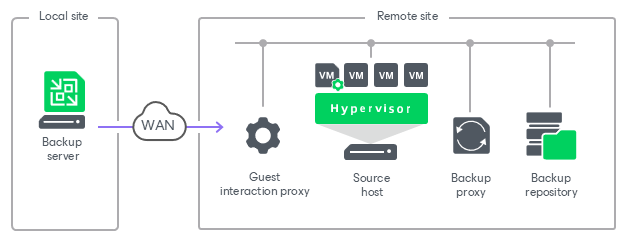
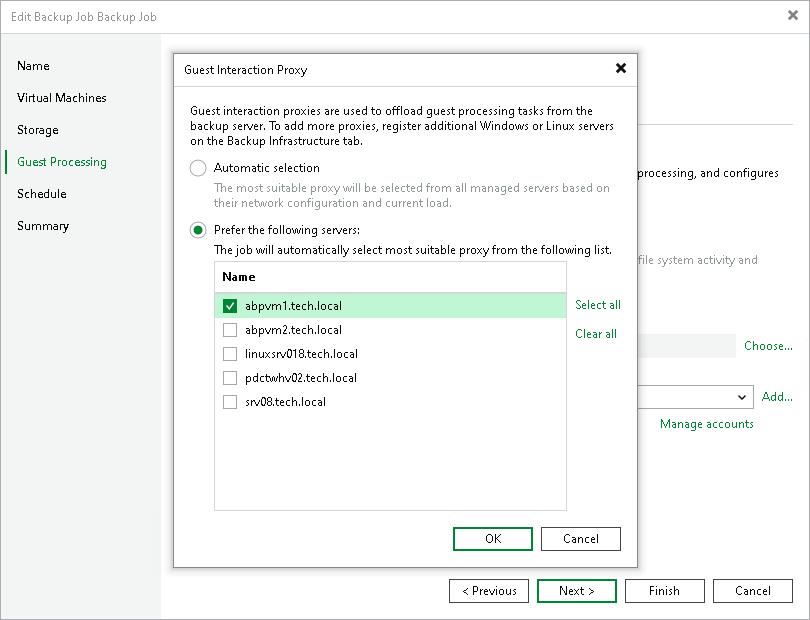

# Guest Interaction Proxies

In this article

The guest interaction proxy is a backup infrastructure component that sits between the backup server and the processed VM. To interact with the VM guest OS, Veeam Backup & Replication needs either to install non-persistent runtime components or use (if necessary, install) persistent agent components in each VM. The task of deploying these components in a VM is performed by the guest interaction proxy. For more information on the components, see [Non-Persistent Runtime Components and Persistent Agent Components](runtime_process.md).

|  |
| --- |
| Note |
| The guest interaction proxy functionality requires a license with Enterprise or higher edition. |

The guest interaction proxy allows you to communicate with the VM guest OS even if the backup server and processed VM run in different networks.

Usage Scenarios

This component is needed if the backup or replication jobs perform the following processing of VMs:

* Application-aware processing
* Guest file system indexing
* Transaction logs processing

Guest Interaction Proxy Deployment

You can use multiple guest interaction proxies to improve performance. Multiple guest interaction proxies will deploy non-persistent runtime components or persistent agent components in VMs faster compared to the same operation performed by one guest interaction proxy.

In a backup infrastructure with multiple remote sites, you can deploy a guest interaction proxy in each site. This can reduce load on the backup server and produce less traffic between the backup server and remote site.

Requirements for Guest Interaction Proxy

A machine performing the role of a guest interaction proxy must meet the following requirements:

* The role of a guest interaction proxy can be assigned to a Microsoft Windows or Linux server (physical or virtual).

If you use RHEL or Rocky Linux version 9 or later, and do not use [Veeam Infrastructure Appliance](linux_infrastructure.md), you must install the following packages before adding the server to the backup infrastructure: libmsi1, samba-client, and samba-common-tools.

* You must add the machine to the Veeam Backup & Replication console as a managed server.
* [For VMware vSphere environments] Guest interaction proxy must have either a LAN or VIX connection to the VM that will be processed. You do not have to set up both connections — only one connection is required. For more information about setting up a connection to the VM, see [this Veeam KB article](https://www.veeam.com/kb1788).
* [For Microsoft Hyper-V environments] Guest interaction proxy must have a LAN connection to the VM that will be backed up or replicated.
* [For Microsoft Hyper-V environments] If you plan to use PowerShell Direct connection to back up VMs that reside on Hyper-V Server 2016 (or later) and run Microsoft Windows 10 (or later) or Microsoft Windows Server 2016 (or later), the guest interaction proxy must have Microsoft PowerShell 2.0 (or later) installed.

The guest interaction proxy role can be performed by any machine that meets the requirements, including VMware or off-host backup proxy, backup repository, WAN accelerator, Microsoft Hyper-V host or backup server.

Guest Interaction Proxy Selection

When you add a server to the backup infrastructure, Veeam Backup & Replication installs Guest Interaction Proxy component on it. For Microsoft Windows hosts, Veeam Guest Interaction Proxy Service is responsible for deployment of non-persistent runtime components or persistent agent components during guest OS interaction. For Linux hosts, the responsible service is Veeam Guest Interaction Service daemon. For more information about the services, see [Veeam Backup & Replication Services](services_and_components.md).

To assign a guest interaction proxy for the job, you must select a Microsoft Windows or Linux machine that will perform the role of the guest interaction proxy at the Guest Processing step of the backup or replication job wizard. You can assign the guest interaction proxy manually, or let Veeam Backup & Replication do it automatically. Veeam Backup & Replication uses the following priority rules to select the guest interaction proxy:

1. A machine in the same network as the protected VM that does not perform the backup server role.
2. A machine in the same network as the protected VM that performs the backup server role.
3. A machine in another network that does not perform the backup server role.
4. A machine in another network that performs the backup server role.

If Veeam Backup & Replication finds several available machines of equal priority, it selects the less loaded machine. The load is defined by the number of tasks that the machine already performs.

|  |
| --- |
| Important |
| Linux-based guest interaction proxies do not support group Managed Service Accounts (gMSAs). If the account specified in the Guest OS credentials field is a gMSA and Microsoft Windows machines are available in the list of guest interaction proxies, Veeam Backup & Replication will automatically select a Microsoft Windows machine for the guest interaction proxy role. You cannot specify a gMSA in the Guest OS credentials field and explicitly select a Linux-based guest interaction proxy. For more information on gMSAs, see [Using Group Managed Service Accounts](using_gmsa.md). |

Failover from Guest Interaction Proxy to Backup Server

If the guest interaction proxy fails to connect to the VM, the guest interaction proxy will not be able to access the VM and deploy non-persistent runtime components or persistent agent components in it. In this case, the backup server will take over the role of guest interaction proxy and deploy the non-persistent runtime components or persistent agent components in the VM.

Related Topics

* [Non-Persistent Runtime Components and Persistent Agent Components](runtime_process.md)
* [Creating Backup Jobs](backup_job.md)
* [Creating Replication Jobs](replica_job.md)
* [Creating VM Copy Jobs](copy_job.md)

Page updated 1/7/2026

Page content applies to build 13.0.1.1071
