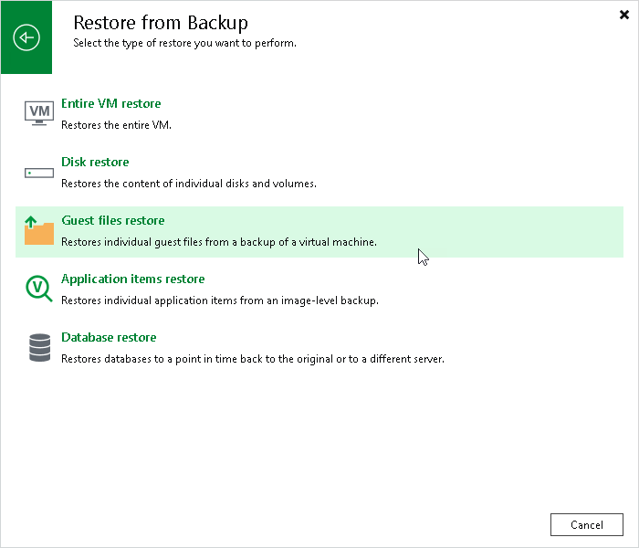

# Step 1. Launch File Level Restore Wizard

To launch the File Level Restore wizard, do one of the following:

* On the Home tab, click Restore > <platform> > Restore from backup > Guest files restore or Restore from replica > Guest files restore.
* Open the Home view. In the inventory pane, select Backups or Replicas. In the working area, expand the necessary backup, click the workload whose files you want to recover and click Guest files on the ribbon. Alternatively, right-click the workload whose files you want to recover and select Restore guest files.

[For VMware vSphere] Alternatively for recovery from storage snapshots, you can open the Storage Infrastructure view. In the inventory pane, expand the storage system tree and select the necessary volume snapshot. In the working area, select a workload whose files you want to recover and click Guest Files on the ribbon. You can also right-click a workload and select Restore guest files.

