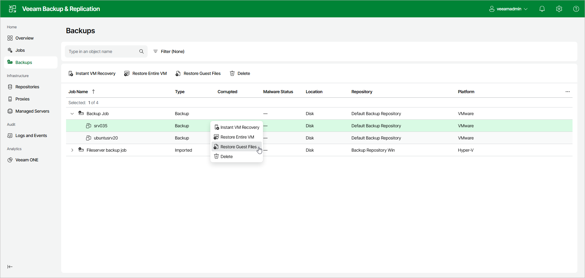

# Step 1. Launch Wizard

To launch guest OS file restore using the web UI, do the following:

1. In the management pane, select Backups.
2. In the working area, select a workload whose files you want to recover.
3. Click Restore Guest Files. Alternatively, you can right-click the selected workload and click Restore Guest Files.

