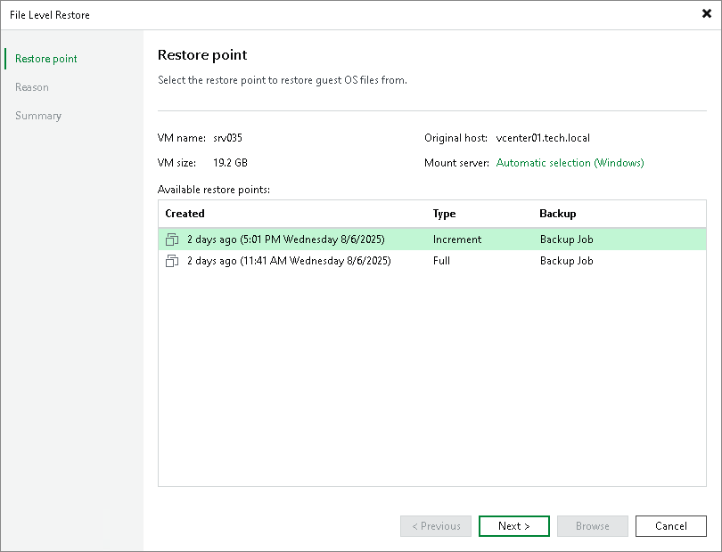

# Step 3. Select Restore Point

The UI of this step differs depending on the source for recovery.

Recovery from Backups and Replicas

At the Restore Point step of the wizard, select a restore point from which you want to recover guest OS files.

Recovery from CDP Replicas

At the Restore Point step of the wizard, select a short-term or long-term restore point from which you want to recover guest OS files. Use your mouse or the right and left arrows on the keyboard to select the required restore point.

To recover to a short-term restore point, select a point in the green area. The darker the green, the more I/O load was produced on the source workload. To recover to a crash-consistent or application-consistent long-term point, select a violet or turquoise vertical bar.

To quickly find a long-term restore point, click a link that shows a date. In the open window, you will see a calendar where you can select the necessary day. In the Timestamp section, you will see long-term restore points created during the selected day.

