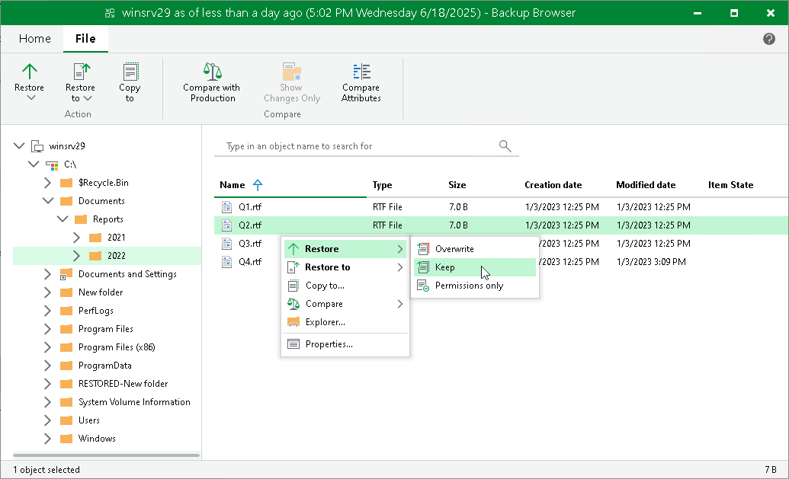
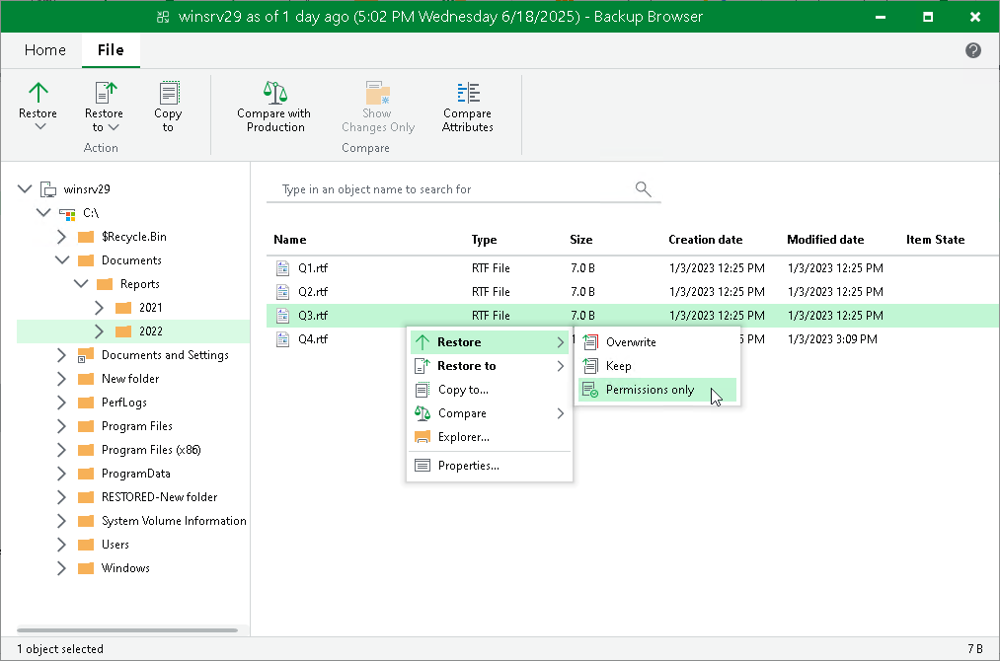
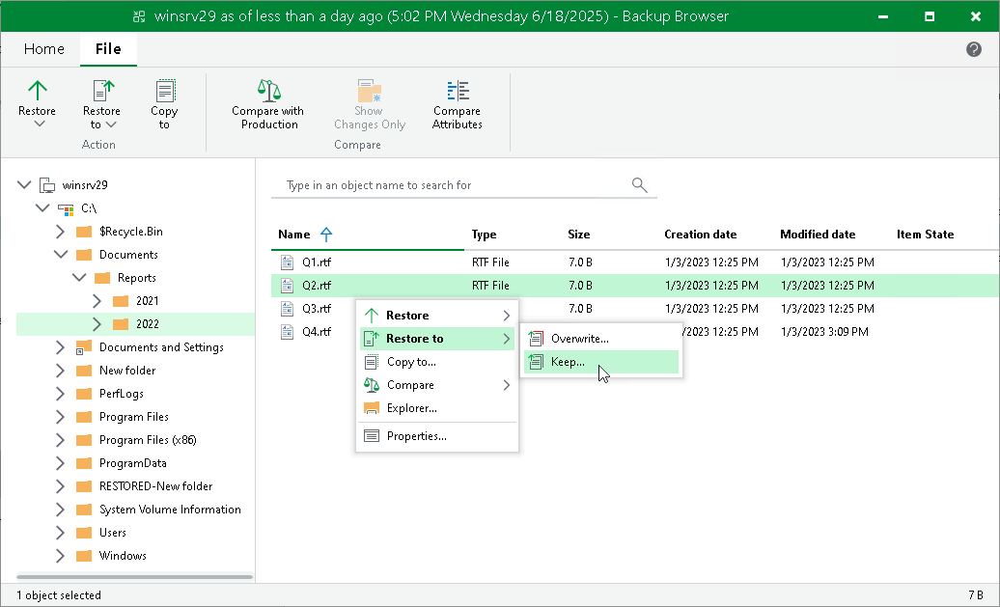
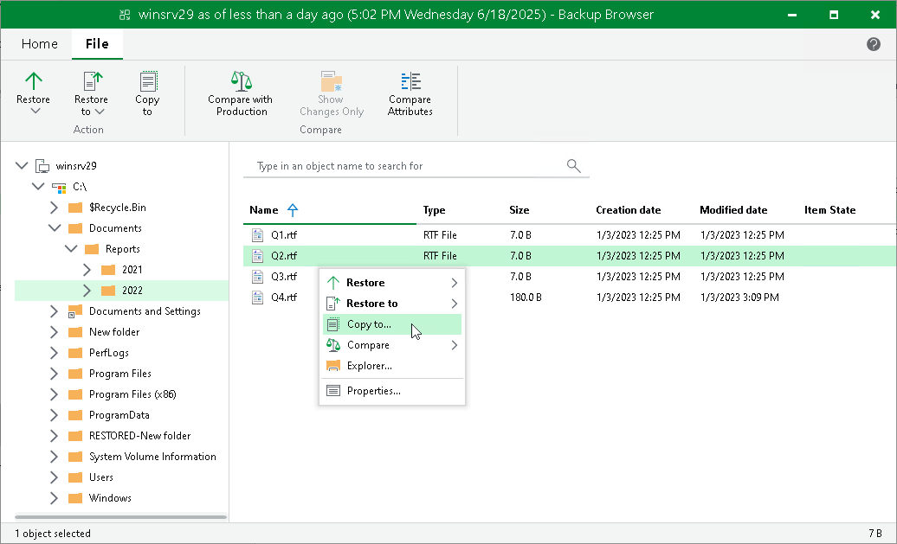
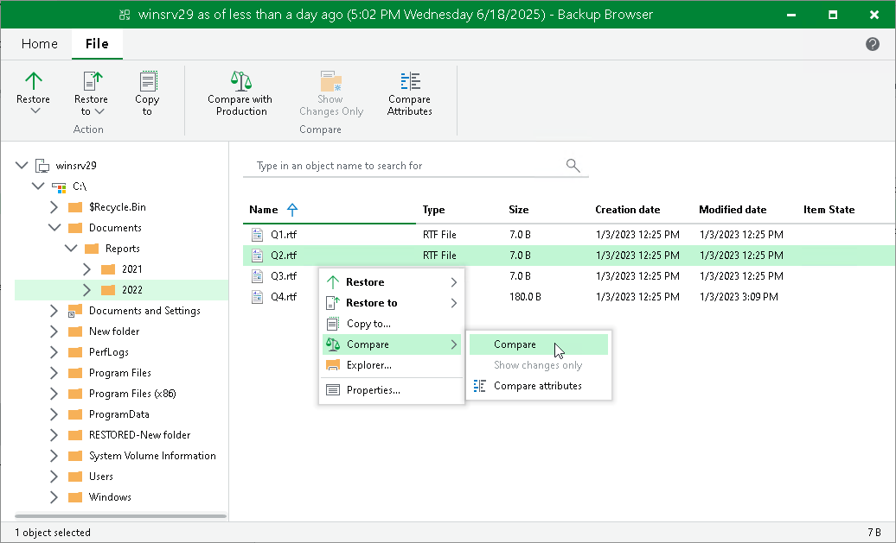
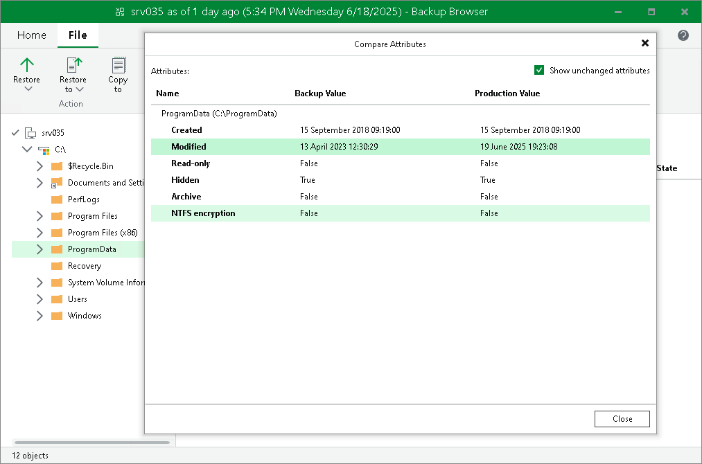
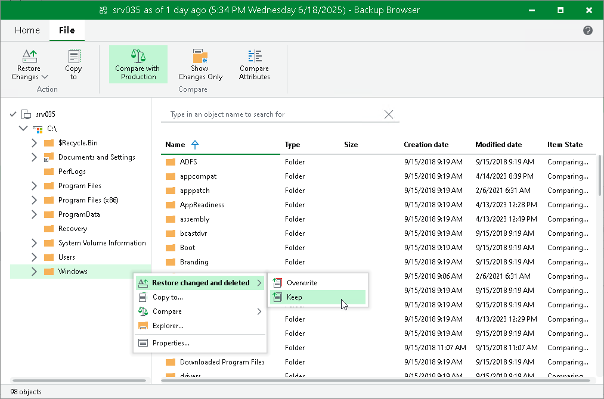
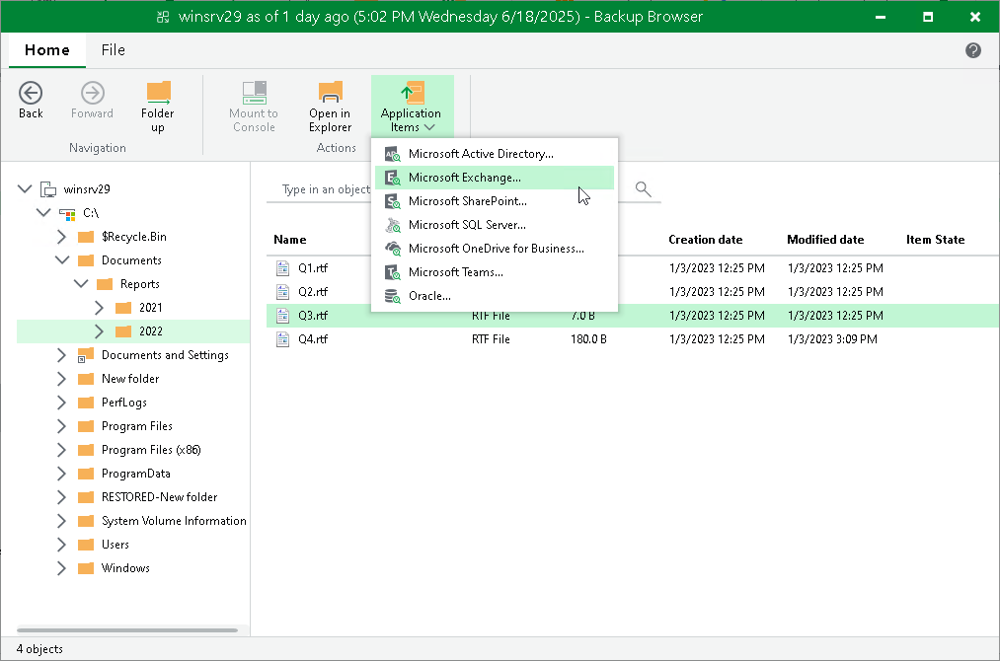

# Microsoft Windows Specific Operations

After you close the wizard, Veeam Backup & Replication opens the Veeam Backup browser with the file system tree of the restored workload.

You can perform the following operations for Microsoft Windows workloads:

* [Recover files and folders to the original location (the Restore command).](#initial)
* [Recover files and folders to another machine in the virtual infrastructure (the Restore to command)](#new_vm).
* [Copy files and folders to the Veeam Backup & Replication console, network shared folder or a new location over the network (the Copy to command)](#other).

* [Compare files and folders from a backup with the original files and folders (the Compare command)](#compare).
* [Recover only changed files and folders to the original location (the Restore changed only command)](#changed).
* [Recover permissions only (the Permissions only command).](#permis)
* [Launch application item restore (the Application items command).](#veeam_explorers)
* [Open files in Microsoft Windows File Explorer.](#explorer)

After you finish restoring files, [close the Veeam Backup browser](#close).

|  |
| --- |
| Note |
| Consider the following:   * To use the restore and comparison functionality, see [Considerations and Limitations](guest_restore_before_you_begin.md). * In the Veeam Backup browser, the names of the restored workload hard disks may differ from the original ones. * Folder symbolic links are displayed under the  icon. |

Restoring Files and Folders to Original Location

This functionality is available for files and folders in the non-comparison state.

To restore files and folders to the original location, do the following:

1. Select the necessary files and folders in the file system tree or in the details pane on the right.
2. Right-click one of the selected items and select one of the following:

* To overwrite the original files and folders with the ones restored from the backup, select Restore > Overwrite.
* To save the restored files and folders next to the original ones, select Restore > Keep.

Veeam Backup & Replication will add the RESTORED\_YYYYMMDD\_HHMMSS postfix to the original names and store the restored items in the same folder where the original items reside.

Alternatively, you can select the same commands on the ribbon.

Veeam Backup & Replication will restore all files and folders. If you want to restore changed files and folders only, see [Restoring Changed Files and Folders](#changed).

Restoring Permissions

This functionality is available for files and folders in the non-comparison state.

To restore permissions for files and folders, do the following:

1. Select the necessary files and folders in the file system tree or in the details pane on the right.
2. Right-click one of the selected items and select Restore > Permissions only. Alternatively, you can select Restore > Permissions only on the ribbon.

Restoring Files and Folders to Another Workload

This functionality is available for backups of VMware vSphere, VMware Cloud Director and Hyper-V VMs created by Veeam Backup & Replication, and backups created by Veeam Agent for Linux, Veeam Agent for Microsoft Windows, Veeam Agent for IBM AIX or Veeam Agent for Oracle Solaris.

To restore files and folders to a new location over the network or without the network, do the following:

1. Select the necessary files and folders in the file system tree or in the details pane on the right.
2. Right-click one of the selected items and select one of the following:

* To overwrite files and folders with identical names in the target location, select Restore to > Overwrite.
* To keep files and folders with identical names in the target location, select Restore to > Keep.

If there are items with identical names, Veeam Backup & Replication will add the RESTORED\_YYYYMMDD\_HHMMSS postfix to the original names and store the restored items in the target location.

Alternatively, you can select the same commands on the ribbon.

1. In the Select Virtual Machine window, select the target workload.
2. In the Credentials window, provide credentials to connect to the target workload.
3. In the Choose Target Folder window, click Browse and select a folder where items will be restored.

Note that the browse option is not available for backups of Hyper-V VMs and backups created by Veeam Agents.

Saving Files and Folders to New Location

To copy files and folders to the workload where the Veeam Backup & Replication console is installed or to a network shared folder:

1. Select the necessary files and folders in the file system tree or in the details pane on the right.
2. Right-click one of the selected items and click Copy to. Alternatively, click Copy to on the ribbon.
3. In the Choose Folder window, select the necessary destination:

+ To recover files and folders to a folder on the workload where the Veeam Backup & Replication console is installed, click Browse to find the necessary folder.
+ To recover files and folders to a network shared folder, enter a path to the destination folder in the Choose folder field.

1. In the Choose Folder window, choose whether to preserve original NTFS permissions or not:

+ To keep the original ownership and security permissions for the restored items, select the Preserve permissions and ownership check box.

Veeam Backup & Replication will copy selected files and folders along with associated Access Control Lists, preserving granular access settings.

* If you do not want to preserve the original ownership and access settings for the restored items, leave the Preserve permissions and ownership check box not selected.

Veeam Backup & Replication will change security settings: the user who launched the Veeam Backup & Replication console will be set as the owner of the restored item, while access permissions will be inherited from the folder to which the restored item is copied.

1. If prompted, in the Credentials window, specify user credentials to access the destination location.

Comparing Files and Folders

When Veeam Backup & Replication compares files, it compares their attributes. When Veeam Backup & Replication compares folders, it compares folder attributes, and also folder and file attributes inside the folder recursively. Once a file or folder with changed attributes is found, Veeam Backup & Replication stops comparing items and marks the folder as changed. If you further browse the folder in the compared state, Veeam Backup & Replication continues comparing non-compared files and folders. Veeam Backup & Replication compares the following attributes: Date Created, Date Modified, Size (only for files), Read-Only, Hidden, Archive, NTFS Encryption.

To compare files and folders from a backup with the files and folders stored in the original location:

1. Select the necessary files and folders in the file system tree or in the details pane on the right. You can also select disks. In this case, Veeam Backup & Replication will compare files and folders stored on the disks.
2. Right-click one of the selected items and select Compare > Compare. Alternatively, click Compare with Production on the ribbon.

1. If prompted, in the Credentials window, specify user credentials to access the original location.

After the comparison, files and folders will have the following comparison states in the Item State column: changed, unchanged, deleted, pending, or failed to compare. The states are updated when you turn off and then turn on the comparison mode, and when you start restoring changes of files and folders. Note that when comparing symbolic links, Veeam Backup & Replication compares attributes of the links, not the attributes of files and folders which the symbolic link points to.

For files and folders in the comparison states, Veeam Backup & Replication provides other restore operations than for files and folders in the non-comparison state. For example, you can restore only changed files and folders. For more information, see [Restoring Changed Files and Folders](#changed).

|  |
| --- |
| Tip |
| To show only changed files and folders (in the changed and deleted states), right-click any area in the Veeam Backup browser and select Compare > Show changes only. Alternatively, click Show Changes Only on the ribbon. Note that, in this case, the search field becomes unavailable. To display all files and folders, click the Show changes only or Show Changes Only option once again.  To switch off the comparison states, select an item in the comparison state, click Compare > Compare. Alternatively, click Compare with Production on the ribbon. Note that if you switch off comparison for child files and folders, comparison for parent folders will also be switched off. |

You can view which attributes were changed for files and folders:

1. Select the necessary files and folders in the file system tree or in the details pane on the right.
2. Right-click one of the selected items and select Compare > Compare attributes. Alternatively, click Compare Attributes on the ribbon.

In the Compare Attributes window, Veeam Backup & Replication shows changed attributes. If you want to show all attributes, click the Show unchanged attributes check box at the top right corner. Note that Veeam Backup & Replication shows attributes for a maximum of 500 files and folders and shows attributes for the selected files and folders, not for the nested files.

Restoring Changed Files and Folders

To restore only changed files and folders to the original location, do the following:

1. Select the necessary files and folders in the file system tree or in the details pane on the right. Note that at least one file or folder must be in a comparison state. Files and folders in the non-comparison state, Veeam Backup & Replication will compare automatically.
2. Right-click one of the selected items and select one of the following:

* To overwrite the original files and folders with the ones restored from the backup, select Restore changed and deleted > Overwrite.

* To save the files and folders restored from the backup next to the original ones, select Restore changed and deleted > Keep.

Veeam Backup & Replication will add the RESTORED\_YYYYMMDD\_HHMMSS postfix to the original names and store the restored items in the same folder where the original items reside.

Alternatively, you can select the same commands on the ribbon.

If you want to restore entire files and folders to the original location, see [Restoring to Original Location](#initial).

Launching Application Item Restore

If you are restoring guest OS files from workloads where the [supported applications](platform_support.md#guest) (Microsoft Active Directory, Oracle and so on) are installed, you can also launch application item restore directly from the Veeam Backup browser. To restore application items, Veeam Backup & Replication uses special tools called Veeam Explorers.

To launch application item restore, do the following:

1. On the ribbon, switch to the Home tab.
2. Click Application Items and select the required application.
3. In the opened Veeam Explorer, perform the necessary operations. For more information on Veeam Explorers, see the [Veeam Explorers User Guide](https://helpcenter.veeam.com/docs/backup/explorers/explorers_introduction.html?ver=13).

Working with Microsoft Windows File Explorer

You can use Microsoft Windows File Explorer to work with restored files and folders:

1. On the ribbon of the Veeam Backup browser, switch to the Home tab and click Mount to Console to mount the workload disks to the Veeam Backup & Replication console.
2. To open Microsoft Windows File Explorer, do the following:

* Click Open in Explorer on the Veeam Backup browser ribbon or right-click the necessary folder and select Explorer.
* Click File Explorer in the Start menu of the workload where Veeam Backup & Replication console is installed. Browse to the C:\VeeamFLR\<vmname>\<volume n> folder where the disks are mounted and find the necessary files.

|  |
| --- |
| Note |
| The Mount to Console button is not available if the mount point is already created on the Veeam Backup & Replication console. |

It is recommended that you use Microsoft Windows File Explorer only to view file content, not to restore files. For guest OS file restore, use the Veeam Backup browser. This browser has the following advantages:

1. You can browse the workload guest OS file system ignoring the file system ACL settings.
2. You can preserve permissions and ownership during file-level restore.

If you open the workload file system in Microsoft Windows Explorer, these capabilities are not available. For more information, see [Microsoft Docs](https://docs.microsoft.com/en-us/windows/desktop/SecAuthZ/privilege-constants).

Closing Veeam Backup Browser

You can browse workload guest OS files only while the Veeam Backup browser is open. After the Veeam Backup browser is closed, Veeam Backup & Replication unmounts disks from the workload where the Veeam Backup & Replication console is installed and from the mount server (if you have restored workload guest OS files to the original location).

It is recommended that you close the Veeam Backup browser after you have finished restoring workload guest OS files. When the Veeam Backup browser is open, the backup file whose guest OS file system is displayed in the browser is locked in the backup repository. As a result, some scheduled operations that use this backup file may fail.

Veeam Backup & Replication checks if there is any activity in the Veeam Backup browser with an interval of 5 minutes. If the user or Veeam Backup & Replication components and services do not perform any actions for 30 minutes, Veeam Backup & Replication displays a warning that the Veeam Backup browser is to be closed in 5 minutes.

After the warning is displayed, you can perform one of the following actions:

* You can close the Veeam Backup browser manually.
* You can click Cancel to postpone the close operation. In this case, the Veeam Backup browser will remain open for 5 minutes. After this period expires, Veeam Backup & Replication will display the warning again.
* You can perform no action at all. In this case, the Veeam Backup browser will close automatically in 5 minutes.

