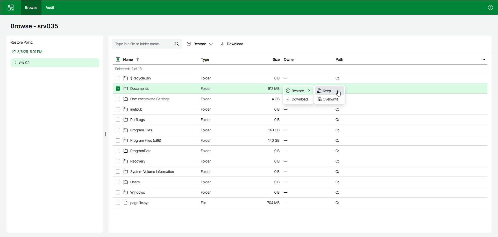
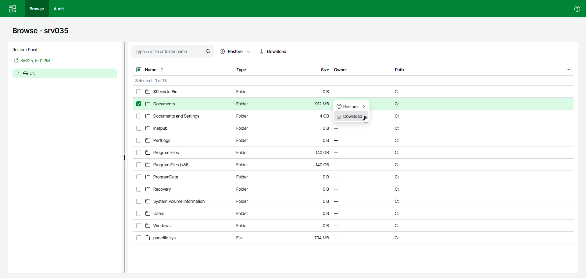
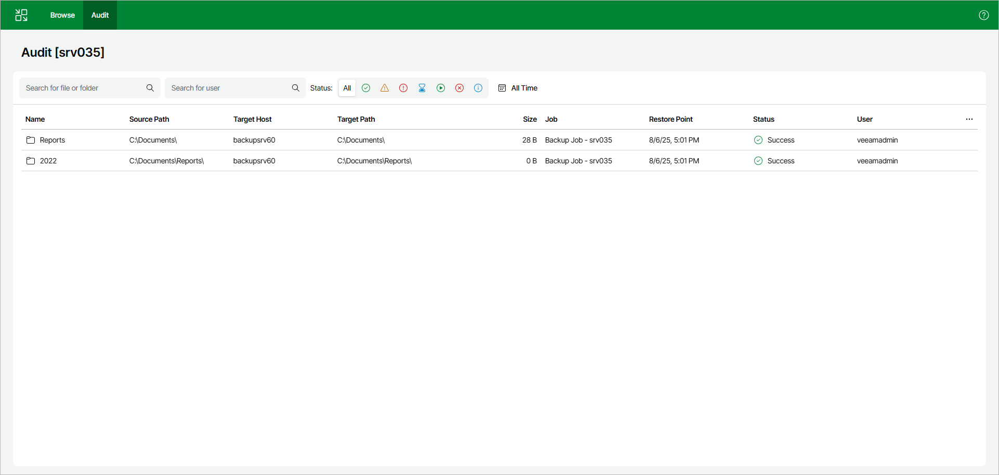

# Step 4. Finalize Recovery

You can recover files and folders to the original location, download files to the machine where the web UI is opened and review which files were recovered.

Restoring Files to Original Location

To recover files and folders to the original location:

1. Select the necessary files and folders in the working area.
2. Right-click one of the selected items and select one of the following:

* To save the restored files and folders next to the original ones, select Restore > Keep.

Veeam Backup & Replication will add the RESTORED\_YYYYMMDD\_HHMMSS postfix to the original names and store the restored items in the same folder where the original items reside.

* To overwrite the original files and folders with the ones restored from the backup, select Restore > Overwrite.

Alternatively, you can select the same commands on the ribbon.

Downloading Files

To download files and folders to a machine where the Veeam Backup & Replication web UI is opened, select files and folders in the working area. Right-click one of the selected items and click Download. Veeam Backup & Replication will start downloading a .ZIP file.

Viewing Recovered Files

To view the list of files that were recovered, navigate to the Audit tab on the top bar.

