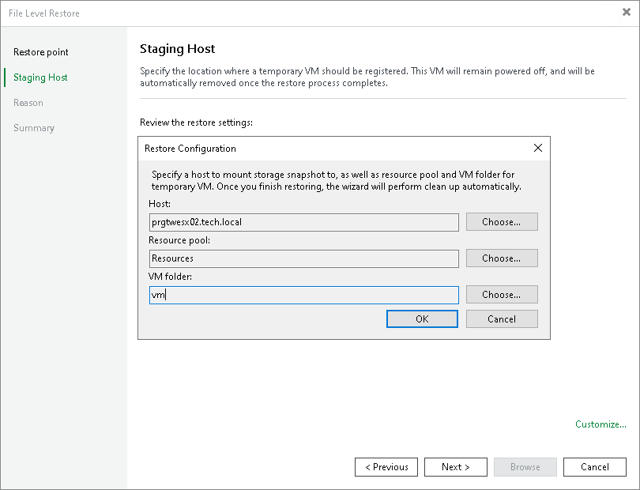

# Step 6. Configure Staging Host

This step is available if you recover files from storage snapshots.

At the Staging Host step of the wizard, select an ESXi host to which the clone/virtual copy of the storage snapshot will be mounted. On the selected ESXi host, Veeam Backup & Replication will create a temporary VM and mount disks of the recovered workload to this temporary VM.

To specify the destination for a snapshot clone/virtual copy and temporary VM:

1. At the Staging Host step of the wizard, click Customize.
2. Next to the Host field, click Choose and select an ESXi host to which the snapshot clone/virtual copy must be mounted and on which the temporary VM must be created.
3. Next to the Resource pool field, click Choose and select a resource pool to which you want to place the temporary VM.
4. Next to the VM folder field, click Choose and select a folder to which you want to place the temporary VM.

