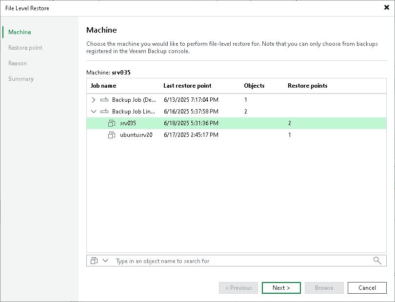

# Step 2. Select Workload

At the Machine step of the wizard, select the workload whose guest OS files you want to recover:

1. In the Machine list, expand the necessary backup.
2. Select the workload.

