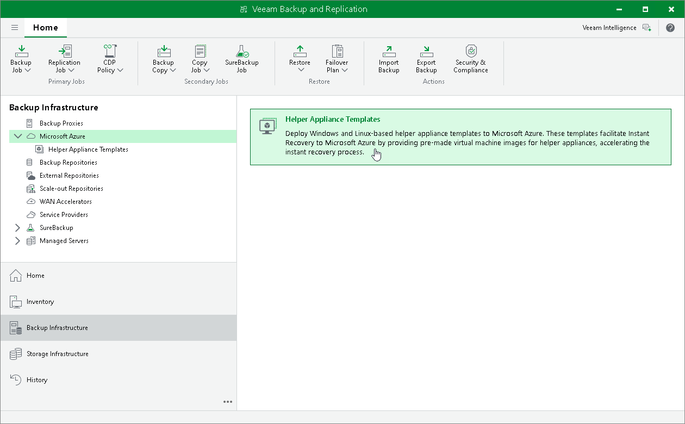
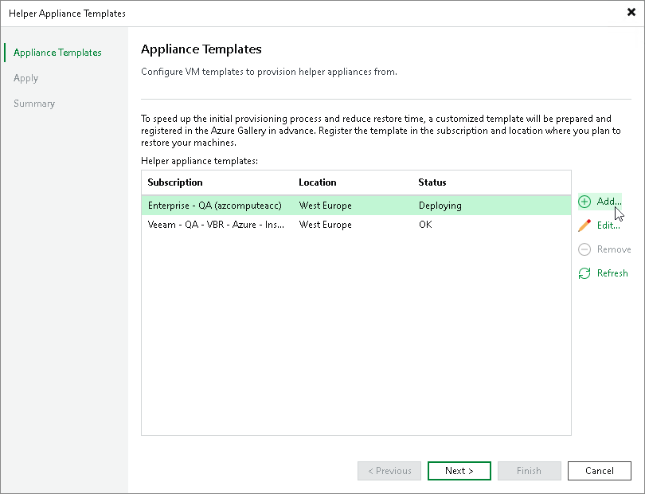
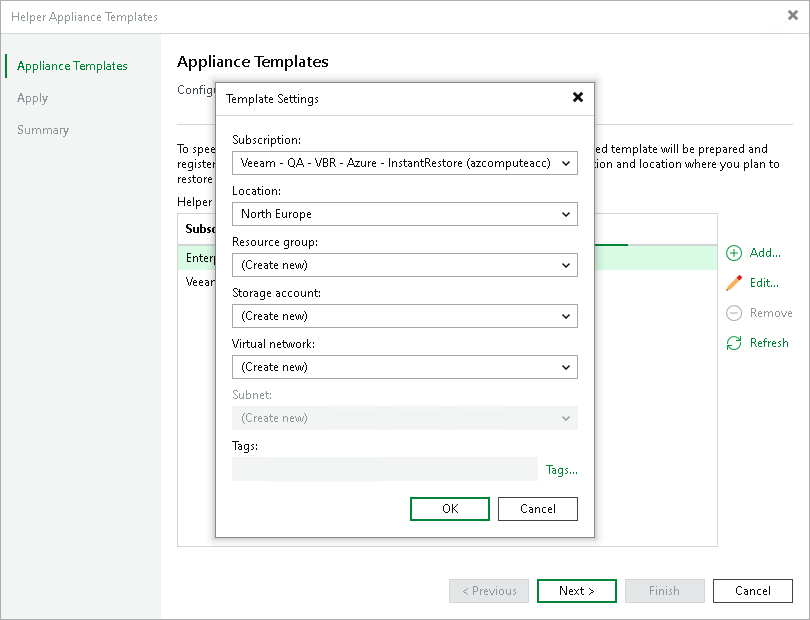

# Adding Helper Appliance Template

To add a helper appliance template, do the following:

1. Open the Backup Infrastructure view.
2. In the navigation pane, select Microsoft Azure.
3. In the working area, click Helper Appliance Templates.

1. In the Helper Appliance Templates wizard, click Add.

1. In the Template Settings window, specify settings for the appliance deployment. Click OK.

In the Subscription and Location fields, specify the subscription and region to which you plan to instantly recover workloads. In the Resource group, Storage account, Virtual Network and Subnet fields, you can specify an existing resource or create a new one. If you choose to create new resources, they will be deleted after the template is deployed. Only the resource group is left to store the template (managed image).

|  |
| --- |
| Important |
| If you plan to select or already have selected an existing network and subnet for the helper appliance template, you must allow access to public endpoints listed in the Temporary Azure VMs used to create templates of Instant Recovery to Azure helper appliances row in the [Instant Recovery to Microsoft Azure port table](used_ports.md#instant_recovery_to_azure).  This is required due to changes in Microsoft Azure. After March 31, 2026, new virtual networks will default to the creation of private subnets, which can no longer use default outbound access connectivity.  VMs that require public endpoint access will need to use explicit outbound connectivity. For more information, see [Microsoft Docs](https://azure.microsoft.com/en-us/updates?id=default-outbound-access-for-vms-in-azure-will-be-retired-transition-to-a-new-method-of-internet-access).  If you select the default option to create a new virtual network and subnet for the helper appliance template, you do not need to allow access to any endpoints. The created temporary subnet will not be private. It will have the allowed outbound internet access and will continue to work even after March 31, 2026. |

1. At the Appliance Template step of the wizard, click Next. Then click Finish. The template will be deployed as a background process.

