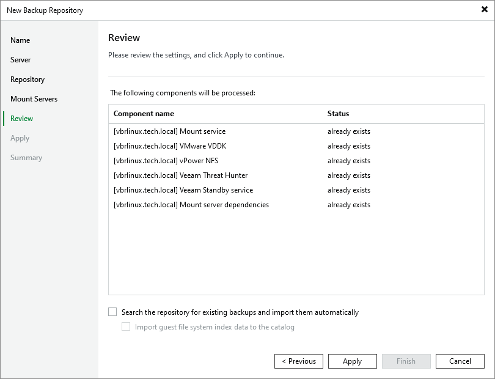

# Step 6. Review Properties and Components

In this article

At the Review step of the wizard, review details of the backup repository and specify importing settings.

1. Review the backup repository settings and list of components that will be installed on the hardened repository server.
2. If the hardened repository contains backups that were previously created by Veeam Backup & Replication, select the Search the repository for existing backups and import them automatically check box. Veeam Backup & Replication will scan the hardened repository to detect existing backup files and display them in the Veeam Backup & Replication console under the Backups > Disk (Imported) node.
3. If the hardened repository contains guest file system index files that were previously created by Veeam Backup & Replication, select the Import guest file system index data to the catalogue check box. Index files will be imported with backup files, and you will be able to search for guest OS files inside imported backups.

Page updated 8/27/2025

Page content applies to build 13.0.1.1071
