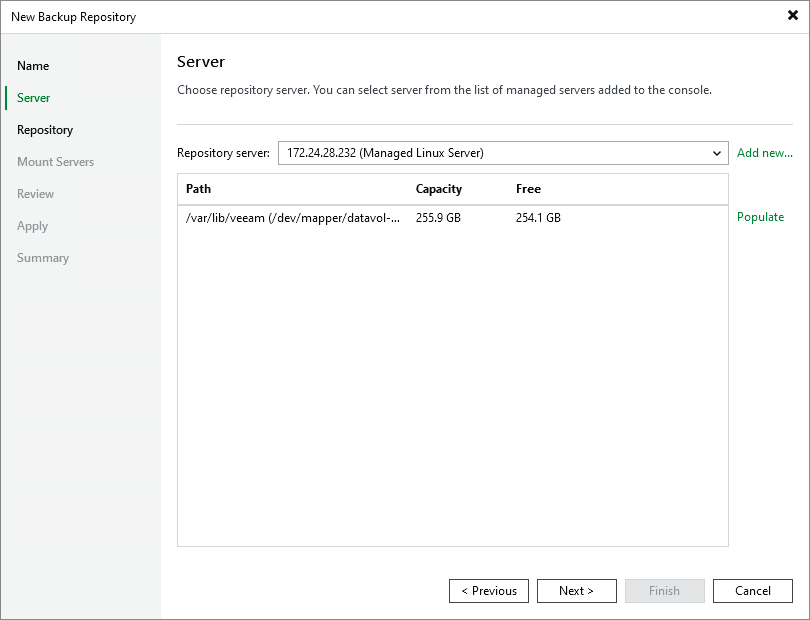

# Step 3. Specify Server Settings

To configure settings for a Linux server:

1. From the Repository server list, select the Linux server that you want to use as a hardened repository. If the server is not added to the backup infrastructure yet, you can click Add New on the right to open the New Linux Server wizard. For more information, see [Adding Linux Servers](add_linux_server.md).

The Repository server list contains only those servers that are added to the backup infrastructure.

1. Click Populate to see a list of disks connected to the server, their capacity and free space.

