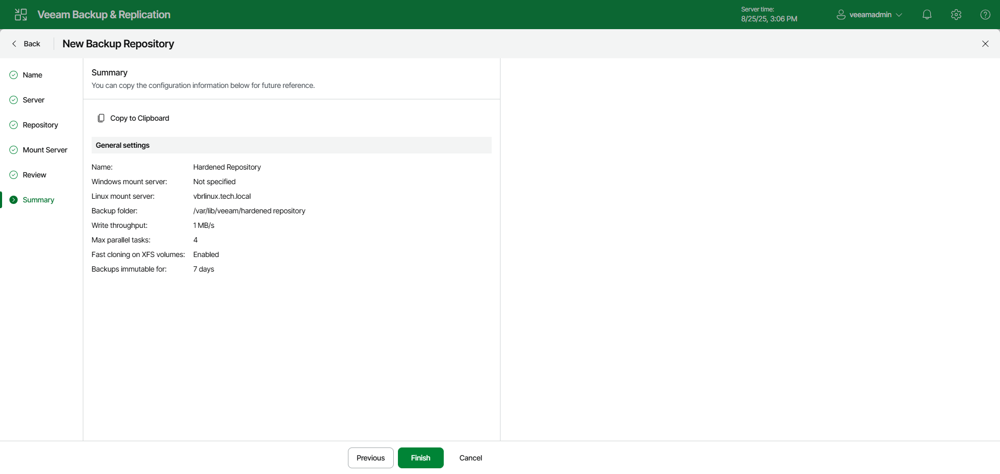

# Step 7. Finish Working with Wizard

In this article

At the Summary step of the wizard, review details of the hardened repository. Then click Finish to complete the procedure of adding the hardened repository to the backup infrastructure. Veeam Backup & Replication will install and configure all required components.

Page updated 11/19/2025

Page content applies to build 13.0.1.1071
