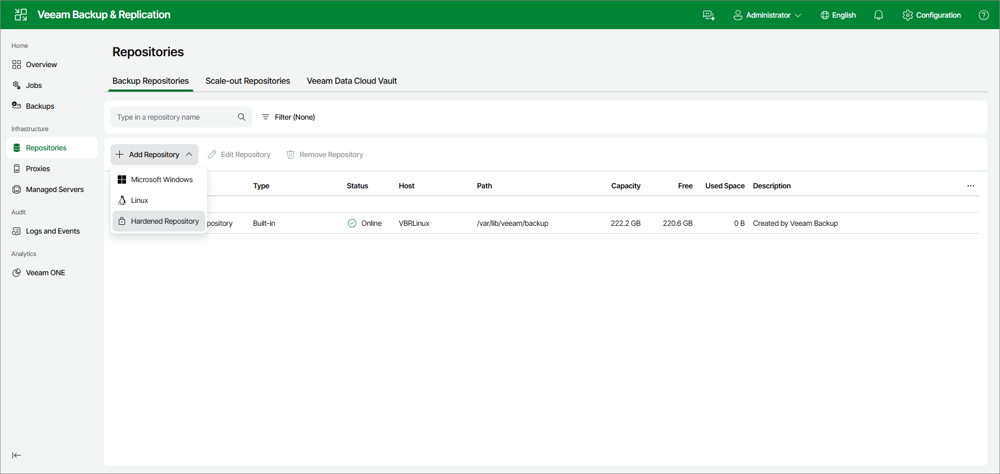

# Step 1. Launch New Backup Repository Wizard

To launch the New Backup Repository wizard, do the following:

1. Open the Repositories node in the management pane.
2. Click Add Repository on the ribbon and select Hardened Repository.

