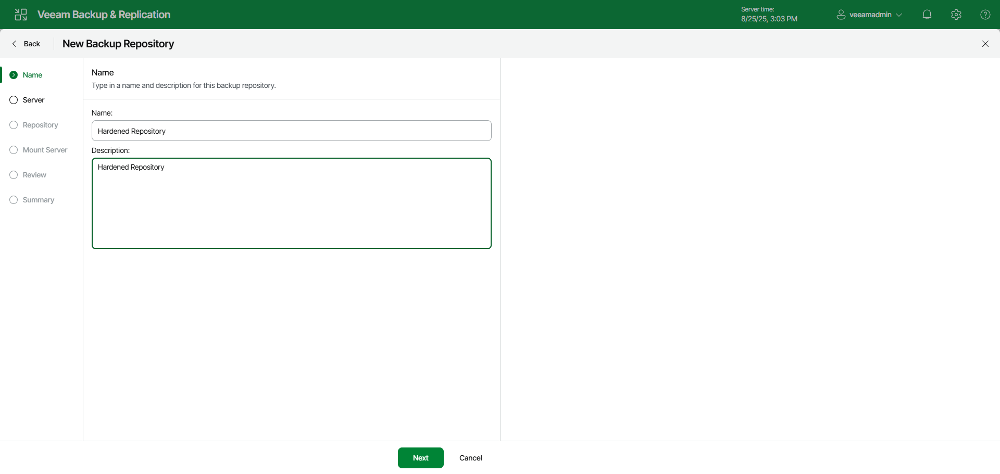

# Step 2. Specify Hardened Repository Name and Description

In this article

At the Name step of the wizard, specify a name and description for the hardened repository:

1. In the Name field, specify a name for the hardened repository.
2. In the Description field, provide a description for future reference.

Page updated 11/17/2025

Page content applies to build 13.0.1.1071
