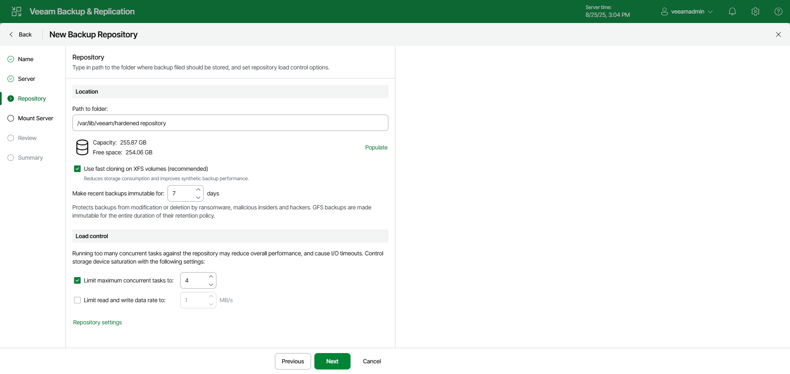

# Step 4. Configure Hardened Repository Settings

In this article

At the Repository step of the wizard, configure hardened repository settings including path to the repository folder, immutability period, load control, and advanced repository settings.

Configuring General Repository Settings

To configure general repository settings:

1. In the Location section, specify a path to the folder where backup files must be stored. Click Populate to check capacity and available free space in the selected location.
2. Select the Use fast cloning on XFS volumes check box to enable copy-on-write functionality. In terms of Veeam Backup & Replication, this functionality is known as Fast Clone. For more information, see [Fast Clone](backup_repository_block_cloning.md).
3. Specify the immutability period.
4. Use the Load control section to limit the number of concurrent tasks and data ingestion rate for the hardened repository. These settings will help you control the load on the hardened repository and prevent possible timeouts of storage I/O operations.

* Select the Limit maximum concurrent tasks check box and specify the maximum allowed number of concurrent tasks for the hardened repository. If this value is exceeded, Veeam Backup & Replication will not start a new task until one of current tasks finishes. For more information, see [Limiting the Number of Concurrent Tasks](limiting_tasks.md).

|  |
| --- |
| Note |
| Consider the following:   * Limitation of concurrent tasks is ignored if the hardened repository acts as a target storage for a Veeam Cloud Connect job.  * If you use backup repositories with per-machine backup chains, it is recommended to select the Limit maximum concurrent tasks to N check box. This option reduces the number of parallel operations performed by synthetic operations (synthetic full backup, backup files merge and transformation). Otherwise, the load on the hardened repository may be high. |

* Select the Limit read and write data rate to check box and specify the maximum rate to restrict the total speed of reading and writing data to the hardened repository disk. For more information, see [Limitation of Read and Write Data Rates for Backup Repositories](limiting_ingestion.md).

|  |
| --- |
| Note |
| The Limit read and write data rate to setting does not apply to health checks performed as part of backup and backup copy jobs. Even if you limit read/write rate for a hardened repository, the health check will consume resources of the hardened repository regardless of this setting. Consider this limitation when configuring basic and health check schedules for backup and backup copy jobs. |

Configuring Advanced Repository Settings

To configure advanced repository settings:

1. Click Repository settings.
2. For storage systems using a fixed block size, select the Align backup file data blocks check box. Veeam Backup & Replication will align VM data saved to a backup file at a 4 KB (64 KB is also possible for ReFS) block boundary.
3. When you enable compression for a backup job, Veeam Backup & Replication compresses VM data at the source side and then transports it to the target side. Writing compressed data to a deduplicating storage appliance results in poor deduplication ratios as the number of matching blocks decreases. To overcome this situation, select the Decompress backup data blocks before storing check box. If data compression is enabled for a job, Veeam Backup & Replication will compress VM data on the source side, transport it to the target side, decompress VM data on the target side and write raw VM data to the storage device to achieve a higher deduplication ratio.

|  |
| --- |
| Note |
| Veeam Backup & Replication does not compress VM data if encryption is enabled for a job and the Decompress backup data blocks before storing check box is selected in the settings of the target hardened repository. Therefore, in the job statistics, you may observe a higher amount of transferred data (the Transferred counter) as compared to a job for which encryption is disabled. For more information on job statistics, see [Viewing Real-Time Statistics](realtime_statistics.md).  In the properties of the backup created with encryption, you may also see that the backup size (the Backup Size column) is larger than the original VM size (the Original Size column). For more information on backup properties, see [Viewing Backup Properties](view_backup_properties.md). |

1. Select the This repository is backed by rotated drives check box if you plan to use a hardened repository with rotated drives. For more information on how to configure rotated drives, see [Deploying Backup Repositories with Rotated Drives](rotated_drives_configure.md).

Page updated 11/17/2025

Page content applies to build 13.0.1.1071
