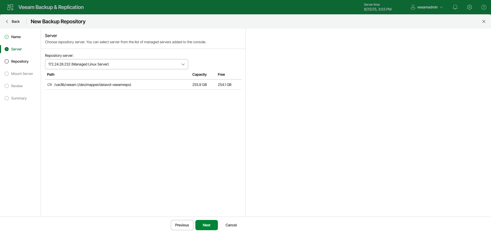

# Step 3. Specify Server Settings

In this article

At the Server step of the wizard, select a Linux server that you want to use as a hardened repository from the Repository server list. The Repository server list contains only those servers that are added to the backup infrastructure.

Page updated 11/17/2025

Page content applies to build 13.0.1.1071
