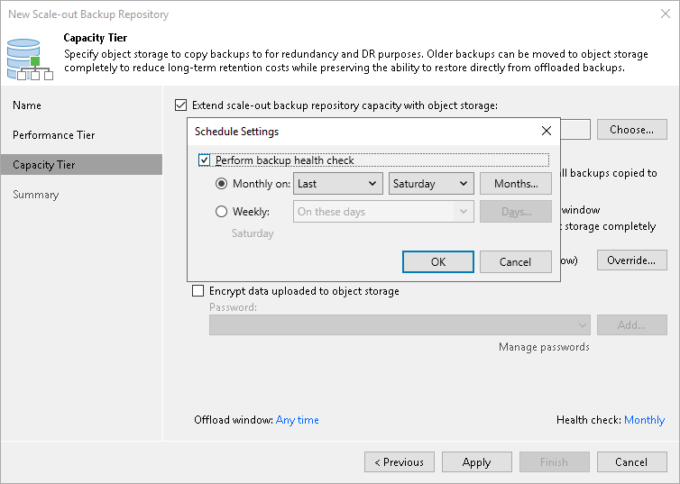

# Health Check for Capacity Tier

A health check is an operation that allows you to ensure that the restore point is consistent, and you will be able to restore data from this restore point. For data located in the capacity tier, Veeam Backup & Replication offers a special health check mechanism that differs from the standard health check in the following ways:

* The health check for capacity tier verifies metadata for the whole backup, not just the latest restore point.
* The health check for capacity tier verifies that data blocks are present on capacity extents of a scale-out backup repository. It does not read data from data blocks. Instead, it lists data blocks to make sure all blocks in the object storage are available for rebuilding every restore point in the backup chain.

If some blocks are missing, Veeam Backup & Replication marks these blocks and restore points associated with them as corrupted. It will prevent Veeam Backup & Replication from reusing the corrupted blocks in certain operations. Instead, Veeam Backup & Replication will upload these blocks to the capacity extent again during the offload session.

If health check detects metadata corruption, Veeam Backup & Replication will mark all backup chain as corrupted. In this case, you will not be able to restore from this backup chain and Veeam Backup & Replication will prevent all offload sessions for the corrupted backup chain. To add a new backup chain to the capacity tier, you must either [delete the corrupted backup chain from capacity tier](deleting_backups_from_sobr.md) or [detach the backup from a backup job](detach_backup.md).

|  |
| --- |
| Note |
| By default, Veeam Backup & Replication uses local resources to perform the health check. The type of the local resource depends on the connection mode of the object storage repository added as a capacity extent:   * For direct connection mode — Veeam Backup & Replication will use a mount server to perform the health check. * For gateway server connection mode — Veeam Backup & Replication will use a gateway server to perform the health check. |

By default, the health check runs monthly every last Saturday and runs during the offload session after backup cleanup completes. You can change the schedule and run the health check weekly or monthly on specific days in the [scale-out backup repository settings](new_capacity_tier.md).

How Health Check for Capacity Tier Works

Veeam Backup & Replication performs the health check of a backup in the following way:

1. Veeam Backup & Replication starts the health check of the whole backup during the first offload session on the scheduled date. Veeam Backup & Replication checks if the metadata of the backup is consistent and no metadata is missing. Veeam Backup & Replication also checks if all data blocks for every restore point are available on the capacity extent. Veeam Backup & Replication does not read data from data blocks.
2. If Veeam Backup & Replication does not find any corrupted data, the health check completes successfully.

If Veeam Backup & Replication detects corrupted data, the health check completes with an error. Depending on the detected data inconsistency, Veeam Backup & Replication behaves in one of the following ways:

* If the health check detects corrupted metadata, the offload session fails. Veeam Backup & Replication will mark all backup chain as corrupted and prevents all offload sessions for the corrupted backup chain. To add a new backup chain to the capacity tier, you must either [delete the corrupted backup chain from capacity tier](deleting_backups_from_sobr.md) or [detach the backup from a backup job](detach_backup.md).
* If the health check detects missing data blocks, Veeam Backup & Replication marks these blocks and restore points associated with them as corrupted. Veeam Backup & Replication will upload these blocks to the capacity extent again during the offload session.

You can view the health check result in the restore point statistics. If the health check finds corrupted data, it will display information on it, as well as list all restore points that share the corrupted data blocks.

|  |
| --- |
| Note |
| For immutable backups, Veeam Backup & Replication performs the health check only for valid restore points according to the retention policy. Immutable data associated with removed restore points can still remain in the repository depending on the immutability period, but Veeam Backup & Replication will not perform the health check for such data. |

