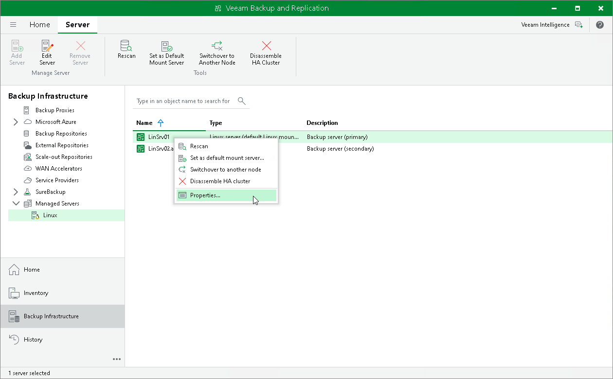

# Editing High Availability Cluster Settings

After you have assembled an HA cluster, you can edit the ports and data transfer options of the primary node.

To edit the HA cluster settings, do the following:

1. Open the Backup Infrastructure view.
2. In the [inventory pane](vbr_ui.md), select Managed servers.
3. In the working area, select the HA cluster primary node, and click Edit Server on the ribbon or right-click the server and select Properties.
4. Edit the node settings as required.

