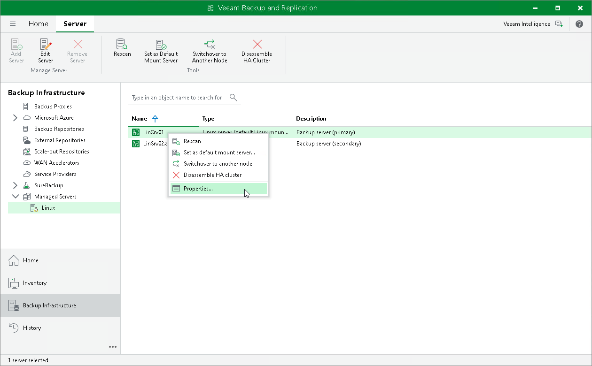

# Editing High Availability Cluster Settings

After you have assembled an HA cluster, you can edit the cluster hostname and IP address. For a cross-subnet HA cluster, you can edit the cluster hostname and the external and internal IP addresses of the primary and secondary nodes.

To edit the HA cluster settings, do the following:

1. Open the Backup Infrastructure view.
2. In the [inventory pane](vbr_ui.md), select Managed servers.
3. In the working area, select the HA cluster primary node, and click Edit Server on the ribbon or right-click the server and select Properties.
4. Edit the node settings as required.

|  |
| --- |
| Note |
| If you change the cluster hostname or IP address and the backup server is managed by Enterprise Manager, Veeam Backup & Replication displays a prompt asking whether to open the Enterprise Manager web UI, since the backup server must be re-added to Enterprise Manager with the new address. |

Page updated 2026-07-22

