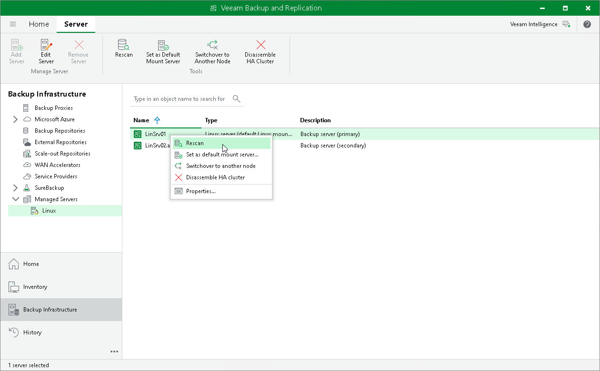

# Rescanning High Availability Cluster

You can rescan the primary node of your HA cluster. The rescan operation may be required if the secondary node has not synchronized with the primary node for an extended period. During the rescan operation, Veeam Backup & Replication retrieves information about the backup infrastructure of the primary node from its configuration database and synchronizes its state with the secondary node.

Veeam Backup & Replication automatically performs a rescan operation every 4 hours. You can also start the rescan operation manually:

1. Open the Backup Infrastructure view.
2. In the inventory pane, select Managed servers.
3. In the working area, select the primary node of your HA cluster and click Rescan on the ribbon. Alternatively, you can right-click the primary node and select Rescan.

