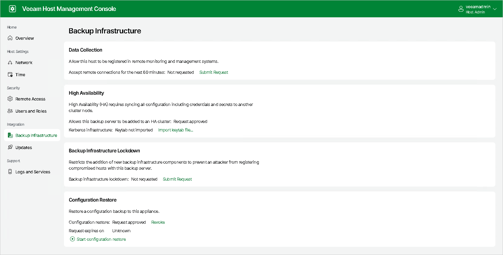

# Before You Begin

In this article

To assemble an HA cluster, you must install Veeam Software Appliance on the Linux-based servers that you plan to use as HA nodes, configure your HA network environment, and enable the High Availability option for both Linux-based servers using [Veeam Host Management Web UI](hmc_access.md). If you use Kerberos authentication, you must create a .keytab file and import it to the primary node using the Veeam Host Management Web UI.

Configuring HA Nodes and HA Network Environment

To configure Linux-based servers that you plan to use as HA nodes and the HA network environment, do the following:

1. [Optional] [Deploy a Veeam Software Appliance](deployment_options.md) on a Linux-based server that you plan to use as a primary node of your HA cluster.
2. Deploy a Veeam Software Appliance on a Linux-based machine that you plan to use as a secondary node of your HA cluster.

|  |
| --- |
| Important |
| The machine you plan to use as a secondary node must have a fresh Veeam Software Appliance deployment with no existing backup data. If any backup data is present, it will be permanently deleted once you assemble the HA cluster. |

1. Assign static IP addresses to both Linux-based servers on your DNS server.
2. Reserve a static IP address for an HA cluster on your DNS server. This IP address will be used to connect to the HA cluster.

|  |
| --- |
| Important |
| If you use Kerberos authentication, you must reserve a static IP address for the cluster within the same network as the Kerberos Key Distribution Center (KDC). |

1. Configure your HA cluster DNS name to resolve to the HA cluster IP address.
2. [For Kerberos authentication] Join both Linux-based servers to a domain where Kerberos authentication is configured. For more information, see [Managing Domain Settings](hmc_configure_domain.md).

Enabling High Availability

After you configure the HA nodes, submit a request to enable the High Availability option for both Linux-based servers. Note that if you have disassembled the HA cluster, you will need to resubmit the request.

To submit the request, do the following:

1. Log in to the [Veeam Host Management web UI](hmc_access.md).
2. In the management pane, click Backup Infrastructure.
3. In the High Availability section, click Submit Request:

+ If you did not configure the [Security Officer](deployment_linux_iso_install_security_officer.md) account during the Veeam Software Appliance installation, the request is approved automatically.
+ If you configured the Security Officer account, you must wait until the security officer approves your request. This approval expires in 8 hours; ensure that you assemble the cluster within this period.

1. [For Kerberos authentication] If you use the Kerberos environment, you must create a .keytab file and import it to the primary node using the [Veeam Host Management Web UI](hmc_access.md).

|  |
| --- |
| Important |
| If you do not upload the .keytab file, you will not be able to authenticate using the Kerberos protocol against your HA cluster. |

Creating Keytab File

To create the .keytab file, do the following:

1. Create a user or computer account in your Active Directory in one of the following ways:

* Specifying the password in the interactive password prompt.

|  |
| --- |
| New-ADComputer -Name <account name> -AccountPassword (Read-Host -AsSecureString "<account password>") -KerberosEncryptionType AES256 -PasswordNeverExpires $true -ServicePrincipalNames HOST/<DNS cluster hostname>,HOST/<DNS cluster hostname>.<domain name> |

* Specifying the password directly in the script.

|  |
| --- |
| New-ADComputer -Name <account name> -AccountPassword (ConvertTo-SecureString "<account password>" -AsPlainText -Force) -KerberosEncryptionType AES256 -PasswordNeverExpires $true -ServicePrincipalNames HOST/<DNS cluster hostname>,HOST/<DNS cluster hostname>.<domain name> |

1. On your Domain Controller (DC), generate the .keytab file. For information on the parameters, see [Microsoft Docs](https://learn.microsoft.com/en-us/windows-server/administration/windows-commands/ktpass#parameters).

|  |
| --- |
| ktpass [/out <filename>] [/princ <principalname>] [/mapuser <useraccount>] [/crypto {AES256-SHA1}] [/ptype {KRB5\_NT\_PRINCIPAL}] [/pass {password|\*|{-|+}rndpass}] [{-|+}setpass <password>] [{-|+}setupn] |

|  |
| --- |
| Important |
| We recommend that you specify the following values for these parameters:   * For the /crypto parameter — specify the AES256-SHA1 value to use the AES256-CTS-HMAC-SHA1-96 encryption type. * For the /ptype parameter — specify the KRB5\_NT\_PRINCIPAL value to use the general principal type. |

Keytab Files Examples

Generating Keytab File Using UPN

|  |  |
| --- | --- |
| This command generates the .keytab file using UPN.  |  | | --- | | ktpass -princ my-ha-cluster-acc$@DOMAIN.LOCAL -mapuser DOMAIN\my-ha-cluster-acc -crypto AES256-SHA1 -ptype KRB5\_NT\_PRINCIPAL -pass password123 -setPass -setUpn -out custom.keytab |  Specify the following parameters:   * Specify the Kerberos principal name for which the .keytab file is generated. Provide the princ parameter value in the host/computer.tech.com@DOMAIN.LOCAL format. Note: This parameter is case-sensitive. * Specify the Kerberos principal to associate with a user or computer account. Provide the mapuser parameter value in the DOMAIN\my-ha-cluster-acc format. * Specify the encryption type key that is generated in the .keytab file. Set the AES256-SHA1 value for the crypto parameter. * Specify the principal type. Set the KRB5\_NT\_PRINCIPAL value for the ptype parameter. * Specify the password for the principal user name. This password is used to generate the key in the .keytab file. Set the password123 value for the pass parameter. Note: Use the asterisk sign (\*) to prompt for a password. * Set the ktpass command to use the password specified in the pass on the user account in Active Directory. Provide the setPass parameter.  * Set the UPN on the account to match the SPN. Provide the setUpn parameter.  * Specify the name of the .keytab file that you want to generate. Set the custom .keytab value for the out parameter. |

Page updated 12/17/2025

Page content applies to build 13.0.1.1071
