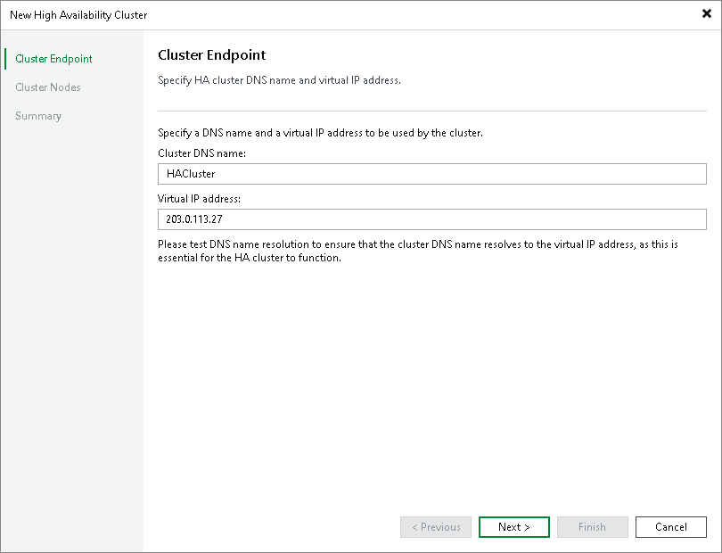

# Step 2. Specify Cluster Settings

In this article

At the Cluster Endpoint step of the wizard, specify the cluster name and a virtual IP address of the cluster.

1. In the Cluster DNS name field, specify a DNS name of the cluster.

|  |
| --- |
| Note |
| If you plan to use the DNS name to access your cluster, you must configure this DNS name to resolve to the сluster IP address. |

1. In the Virtual IP address field, specify the static IP address of the cluster. Veeam Backup & Replication will assign this IP address to the primary node.

Page updated 1/13/2026

Page content applies to build 13.0.1.1071
