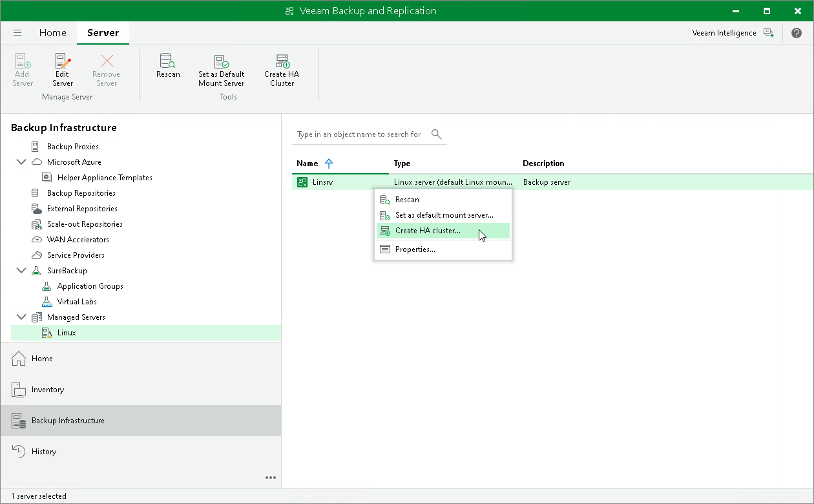

# Step 1. Launch New High Availability Cluster Wizard

In this article

To launch the New High Availability Cluster wizard, do the following:

1. Connect the Veeam Backup & Replication console to the machine that you plan to use as the primary node.
2. Open the Backup Infrastructure view.
3. In the [inventory pane](vbr_ui.md), select Managed Servers.
4. In the working area, select the Linux host and click Create HA Cluster on the ribbon. Alternatively, right-click the necessary Linux host and select Create HA Cluster.

Page updated 1/13/2026

Page content applies to build 13.0.1.1071
