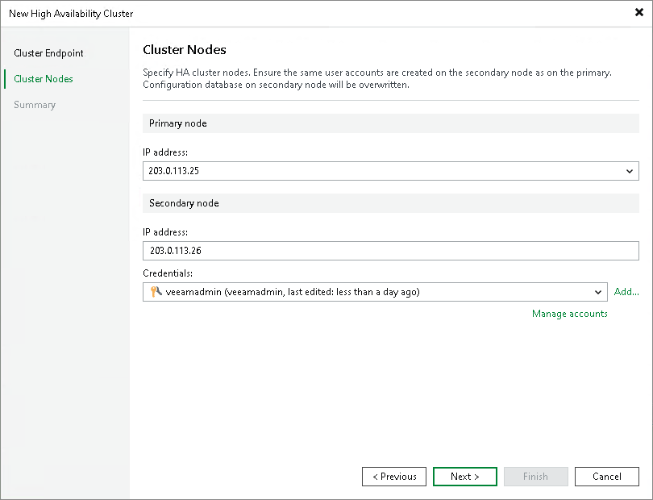

# Step 3. Specify Cluster Nodes Settings

At the Cluster Nodes step of the wizard, you must specify details for primary and secondary nodes.

1. In the Primary node section, from the IP address drop-down menu, select the IP address of the primary node.
2. In the Secondary node section, in the IP address field, specify the IP address of the secondary node.
3. From the Credentials drop-down list, select credentials for the administrator account that you use to access the secondary node. If you have not set up credentials beforehand, click the Manage accounts link or click Add on the right to add the credentials. For more information, see [Credentials Manager](credentials_manager.md). Veeam Backup & Replication will use the provided credentials to access the secondary backup server.

|  |
| --- |
| Note |
| The local Veeam Software Appliance users do not sync between the primary and the secondary nodes. If you create a local user on the primary node, you must create this user on the secondary node. If you do not do this, you will not be able to log in to the secondary node after switchover using the local user credentials. |

