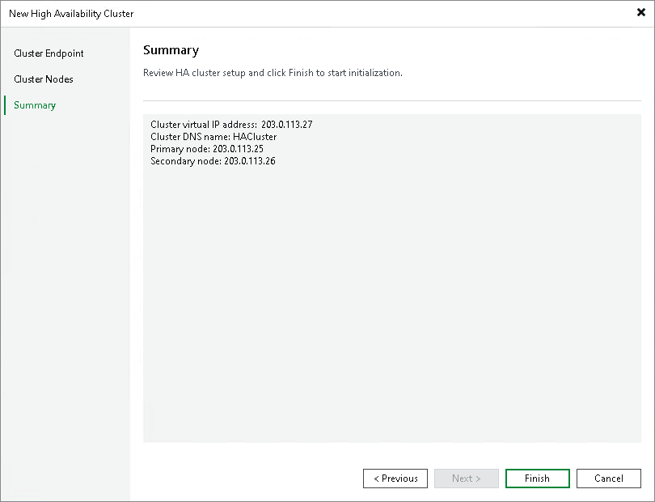

# Step 4. Finish Working with Wizard

In this article

At the Summary step of the wizard, complete the procedure for adding an HA cluster.

1. Review details of the HA cluster.
2. Click Next, then click Finish to exit the wizard.

After you configure the HA cluster, Veeam Backup & Replication displays a yellow bar during HA cluster initialization. When the yellow bar disappears, the cluster is ready for use. The second node will appear under the Managed server node.

Page updated 11/14/2025

Page content applies to build 13.0.1.1071
