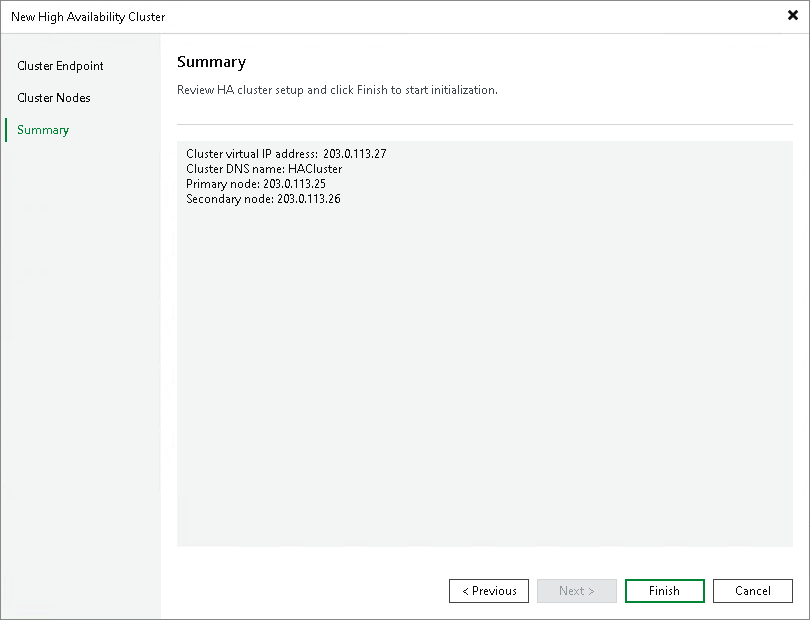

# Step 5. Finish Working with Wizard

At the Summary step of the wizard, complete the procedure for adding an HA cluster.

1. Review the settings of the HA cluster: cluster mode and cluster DNS name. For a standard HA cluster, review the virtual IP address. For a cross-subnet HA cluster, review the external and internal IP addresses of the primary and secondary nodes.
2. Click Next, then click Finish to exit the wizard.

After you configure the HA cluster, Veeam Backup & Replication displays a yellow bar during HA cluster initialization. When the yellow bar disappears, the cluster is ready for use. The second node will appear under the Managed server node.

Page updated 2026-07-08

