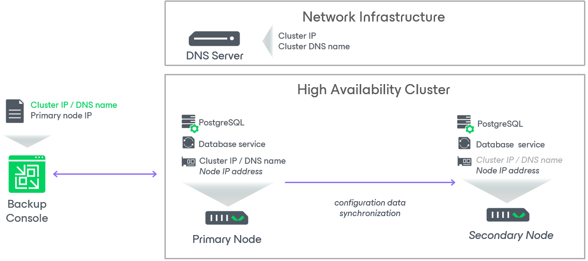

# Infrastructure for High Availability Cluster

The following components are required to configure an HA cluster.

* [Linux-Based Backup Servers used as HA Cluster Nodes](#nodes).
* [Veeam Backup & Replication console](#console).
* [DNS server](#dns).

Linux-Based Backup Servers used as Server Nodes

Linux-based backup servers are the Linux-based machines that you plan to use as the primary node and the secondary node. The primary node may already have installed and running Veeam Software Appliance. For the secondary node, you must deploy a new Veeam Software Appliance. After configuring an HA cluster, Veeam Backup & Replication utilizes the following built-in components on both nodes to perform synchronization between the nodes:

* The veeamhasvc.service — the High Availability service that is responsible for the cluster assembly, failover, switchover, and the HA cluster disassembly operations.
* The PostgreSQL instance — the database that contains information on the HA cluster configuration and synchronizes data between the nodes.
* WAL files storage — the /var/lib/veeamdata/pgsql/pg\_wal directory on the primary node, where Veeam Backup & Replication stores the delta as WAL files if the secondary node is not available. Once the connection is established, Veeam Backup & Replication sends this delta to the secondary node.

Veeam Backup & Replication Console

A Veeam Backup & Replication console is a Windows-based machine with the Veeam Backup & Replication console installed that you use to access and manage the Linux-based backup server and configure an HA cluster. To connect to the backup server after the HA cluster is assembled, the Veeam Backup & Replication console uses either the HA cluster IP address or its hostname.

After the Veeam Backup & Replication console establishes a connection with an HA cluster, it creates a local cache with information about the HA cluster, including the IP addresses of both nodes and their roles. Veeam Backup & Replication console stores this information in the C:\Users\<USERNAME>\AppData\Local\Veeam\_Software\_Group\_GmbH location on the machine where the console is installed. The Veeam Backup & Replication console uses this cache to connect to the HA cluster and obtain the status of both nodes. This information is essential for performing switchover or failover operations, and it helps prevent a failover to the secondary node while the primary node is still running.

DNS server

Your DNS server with the following network infrastructure configured:

* Forward and reverse lookup zones that contain DNS records for the cluster endpoint, primary node and secondary node.
* Virtual cluster IP address — the static IP address that is assigned to the primary node. You must use this IP address to access the backup server after you create the HA cluster cluster. If you perform switchover or failover, and the secondary node takes over the role of the primary node, Veeam Backup & Replication assigns this IP address to the new primary node.
* Cluster DNS name — the DNS name that is assigned to the cluster. You can use this DNS name instead of the cluster IP address to access the backup server.
* Static IP addresses reserved for the primary and the secondary nodes — these IP addresses must belong to the cluster subnet and are required for internal communication between nodes, including database synchronization and backup server updates.

|  |
| --- |
| Note |
| To access an HA cluster using the Host Management console, you must use the IP addresses assigned to the HA nodes. |

Infrastructure for Cross-Subnet HA Cluster

The cross-subnet HA cluster allows you to deploy cluster nodes in different subnets or geographic locations. Unlike the standard HA cluster with 1 IP address assigned to the primary node, the cross-subnet HA cluster has 2 IP addresses assigned to each node that allows to assemble the cluster when the cluster nodes are in different networks. Therefore, each node of the cross-subnet HA cluster has the following IP addresses:

* Primary node external IP address — used to connect to the node and should always permit connections on port 443.
* Secondary node external IP address — used to connect to the node after a switchover or failover. When the HA cluster is configured, Veeam Backup & Replication applies a firewall rule to this address so that it always rejects connections on port 443.
* Internal IP addresses for primary and secondary nodes — used for node-to-node communication, including PostgreSQL database replication and cluster synchronization.

After a switchover or failover, the node roles swap: the new primary node external IP address begins accepting connections, and the new secondary node external IP address begins rejecting them.

DNS Server Settings for Cross-Subnet HA Cluster

Your DNS server must have the following network infrastructure configured:

* Cluster DNS name resolution — configure your DNS server to resolve the cluster DNS name to the external IP addresses of both the primary and the secondary node.
* Create two A (or AAAA) records for the same cluster hostname, each pointing to one node external IP address. When a client resolves the cluster hostname, DNS returns both addresses.
* Port 443 access — the external IP address of the primary node must always permit connections on port 443. The external IP address of the secondary node must always reject connections on port 443.

|  |
| --- |
| Important |
| Consider the following:   * Always connect using the cluster DNS name, not the specific node address. * Using a hosts file instead of DNS is not supported. Instead, you can use the DNS Fast Fallback (also known as Happy Eyeballs) mechanism, which resolves the cluster hostname to a list of IP addresses and tries each one in order until a connection succeeds. For more information on the Happy Eyeballs algorithm, see [RFC 8305](https://www.rfc-editor.org/info/rfc8305/). |

Page updated 2026-07-23

