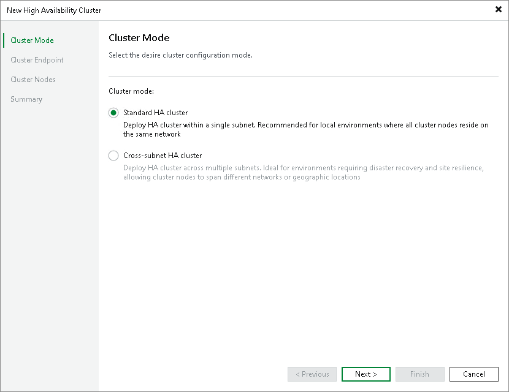

# Step 2. Specify Cluster Mode

At the Cluster Mode step of the wizard, select the desired cluster configuration mode.

1. In the Cluster mode section, select the desired mode

* Standard HA cluster mode — deploys the HA cluster within a single subnet. Select this option for local environments where all cluster nodes reside on the same network.
* Cross-subnet HA cluster mode — deploys the HA cluster across multiple subnets. Select this option for environments that require disaster recovery and site resilience, where cluster nodes span different networks or geographic locations.

Page updated 2026-06-26

